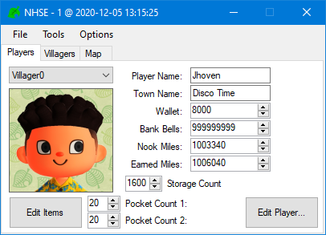
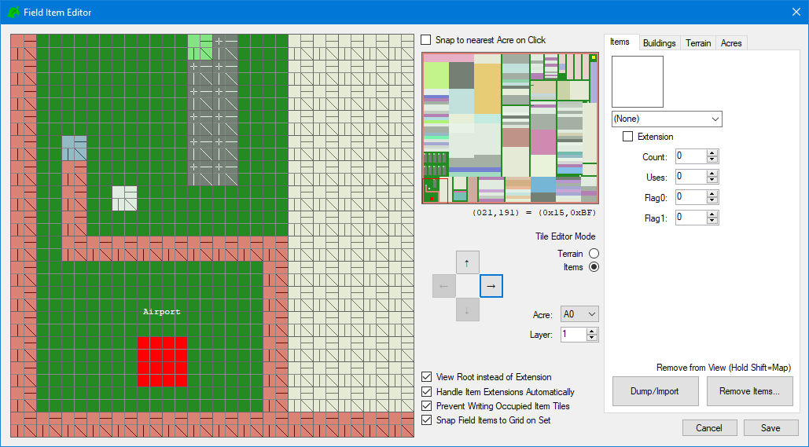
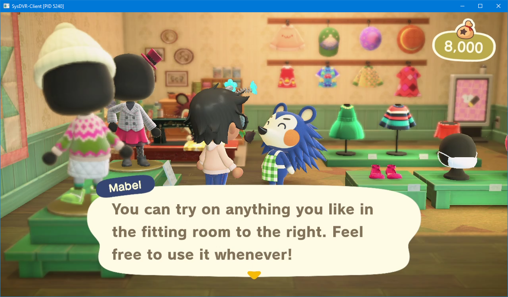
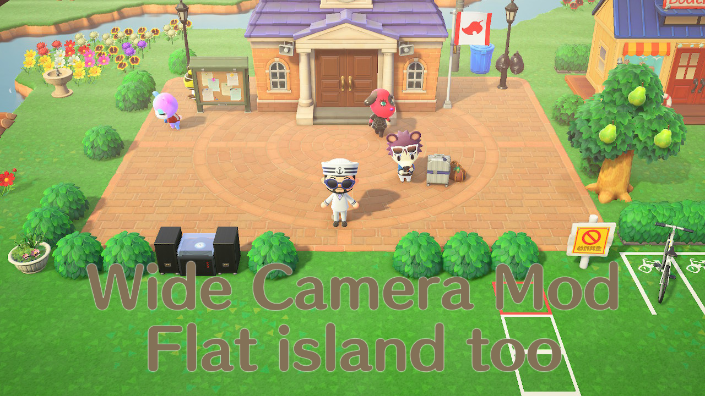
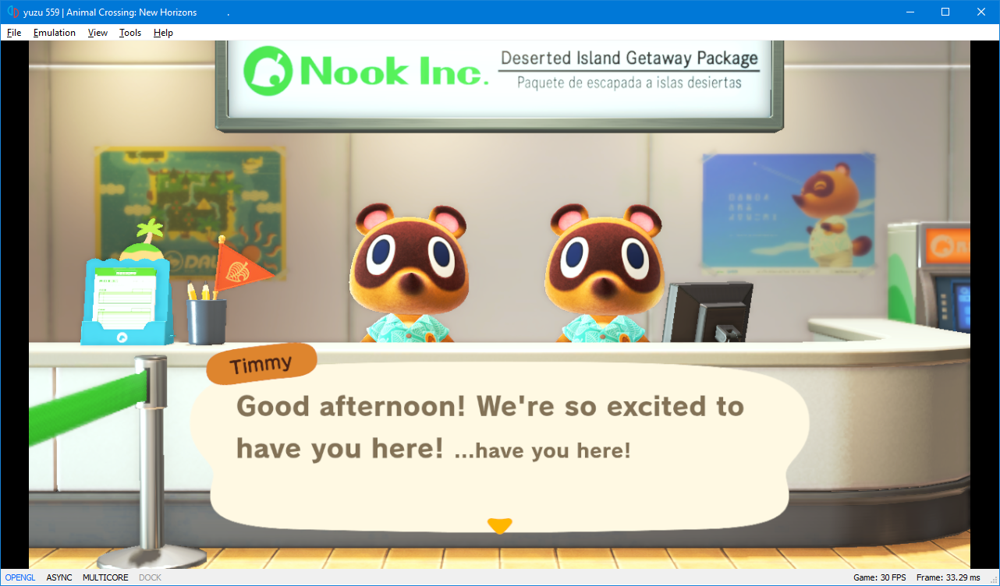

<html>
 <head>
  <meta name="description" content="Choose what you would like to learn! Is modding your thing? Or are you more of a save editor? You'll be satisfied either way!">
  <title>ACNH Available Catalog</title>
</head> 
</html>

# ACNH
# What would you like to look at?
**Simply click on the hyperlink at the start of the section.**

1. [Save Editing](#save-editing)
2. [Streaming](#streaming)
3. [Mods](#mods)
4. [Emulating](#emulating)

## Save Editing

[`NHSE` (New Horizons: Save Editor) is what's used to save edit New Horizons.](/ACNH/NHSE) It allows you to change basically everything you could think of, from the amount of bells your character has, to even changing your island from a 1-star to a 3-star, when it's VERY obvious that you don't have that beautiful island to show it. You can also edit your map from the `Field Item Editor`, which is how people get beautiful treasure islands like this.
 
=

## Streaming

[Learn how to stream Animal Crossing from your switch, **with** ***OR*** **without** a capture card.](/ACNH/streaming) Streaming *with* a capture card does not require a hackable Swich. However, if you are able to use CFW, you can use SysDVR to stream games at a decent quality, and no need for a capture card. The picture below is use of SysDVR.
 
=

## Mods

[Learn how to **get** or **make** mods, and then install them to your game.](/ACNH/mods) Note that not all mods are safe to use online, so when using mods, understand that there's always a chance you won't be able to go online with it (or even end up getting banned)
 
=
## Emulating

[Learn how to play Animal Crossing on your PC with either Yuzu or Ryujinx.](/ACNH/emulation) Emulating requires pretty decent hardware for the game to run at full speed, no lag. So if your Macbook Air from 2012 can't open Chrome without the thing dying, then you probably shouldn't even try.
 
=
