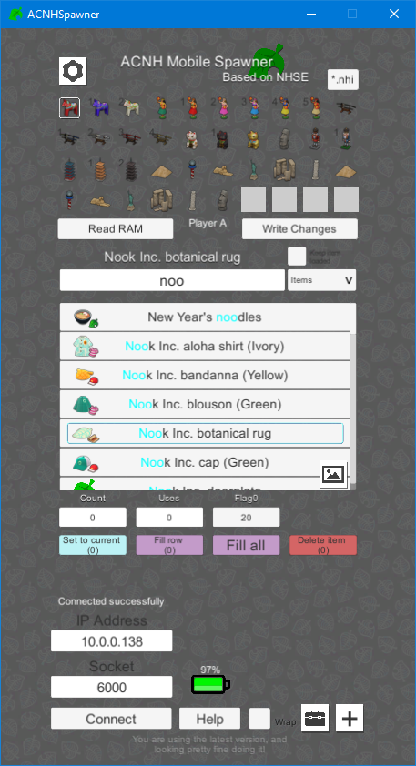

# ACNHMS

The Mobile Spawner is a live injector for New Horizons, allowing you to spawn (inject) items into your inventory, change your villagers, edit critter spawn rate, regenerate your island, and more. It was made by Berichan and is one of two live injectors currently available.

## Comparing the Mobile Spawner to Poker

A question that comes up a lot is whether to use the Mobile Spawner or [Poker](Poker). When it comes down to it, there aren't many things the Mobile Spawner has that Poker doesn't. They function the same, so if you used one then switching to the other wouldn't be as hard. It just comes down to which UI you like better. 

## Downloading

To use the MS, you'll first need sys-botbase to connect your switch to your PC.

1. Go to [https://github.com/olliz0r/sys-botbase/releases](https://github.com/olliz0r/sys-botbase/releases) and download the latest version.
2. Extract the `sys-botbase.zip` and place it on your SD card.
   - You want to have a `430000000000000B` folder inside the `atmosphere/contents/` folder. If you don't, then it's not installed correctly.
3. When it's installed, boot into CFW, and then open Animal Crossing.
   - You'll know it's installed correctly, because your home button will glow blue.