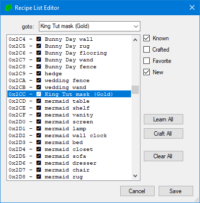
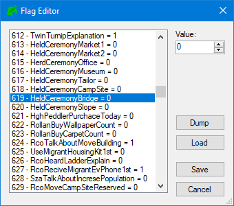

<html>
 <head>
  <meta name="description" content="A guide for NHSE, the most popular New Horizons Save Editor!">
  <title>NHSE Guide</title>
</head> 
</html>

# NHSE

<big>**Table of Contents**</big>

- [NHSE](#nhse)
  - [What is NHSE?](#what-is-nhse)
  - [Downloading NHSE](#downloading-nhse)
  - [Opening NHSE](#opening-nhse)
    - [Extracting Save with JKSV](#extracting-save-with-jksv)
    - [Importing Save to NHSE](#importing-save-to-nhse)
  - [Using NHSE](#using-nhse)
  - [Internal Items](#internal-items)
  - [Players Tab](#players-tab)
    - [Edit Player...](#edit-player)
  - [Villagers Tab](#villagers-tab)

## What is NHSE?

`NHSE` (New Horizons: Save Editor) is, as the name suggests, a save editor for New Horizons. It was made by Kurt ([kwsch](https://github.com/kwsch)), written in C# and is the longest standing save editor for NH. [MyHorizons](https://github.com/Cuyler36/MyHorizons) by [Cuyler36](https://github.com/Cuyler36) was (and still is, afaik) the only other save editor for NHSE, however it has been discontinued (once again afaik, there hasnt been a commit in a year)

## Downloading NHSE

There are 2 ways to download NHSE. The easiest is shown first

1. Go to https://berichan.github.io/GetNHSE/, and click the BIG button that says `Download Latest NHSE Version`. This will download a .zip, and inside it will be NHSE and all of the needed files for it.

<p align="center">
 
</p>

<sub>Everything inside NHSE (as of the time writing this). If your folder does not have everything shown in this screenshot, then you should probably try downloading NHSE again.</sub>

<p align="center">
 
</p>

1. Downloading compiled buids (info taken from [kurts wiki](https://github.com/kwsch/NHSE/wiki/Downloading-Compiled-Builds))

A gif tutorial is shown, to help out a bit

- On [the Github page](https://github.com/kwsch/NHSE), click the green checkmark

- Click "Details" in the popup

- Click "View more details on Azure Pipelines"

- Click the "Published" button under Artifacts

- Click the 3 dots to the right, then click "Download Artifacts"

<p align="center">
 
</p>

## Opening NHSE

Extract the `NHSE.zip` you've just downloaded, and open `NHSE.exe`. **You MUST extract the zip to use NHSE**. If you don't, you will get an error that looks a little something like this. If you get this, you know what you did wrong.

<p align="center">

</p>

This page assumes you already have CFW, and if you don't, then you can [follow a guide here.](../switch-guide)

### Extracting Save with JKSV

NHSE is a **Save Editor** (hence the name New Horizons: Save Editor). This obviously means that you're gonna need to extract your save for use with NHSE! JKSV currently is the only homebrew app that can do this. This is because ACNH uses Device Saves, and Checkpoint (another big save extractor) doesn't support this.

---

<big><big>**Before extracting your save, try finishing most of the game. You don't want to rely on NHSE too much to finish it for you, since plenty of errors can come your way if you decide to cheat your way through. Errors that might just completely prevent you from loading your save. If you aren't gonna listen to the big message in front of you, at least make a backup of your save.**</big></big>

---

1. Download the [`JK has to go back to work edition` release of JKSV](https://github.com/J-D-K/JKSV/releases/download/06.07.2020/JKSV.nro). This version is recommended more than latest.
2. Drag `JKSV.nro` into the `switch` folder on root.
   - No, **not in a folder called `root`**. Open your sd card, and without being in any folders already, you'll see a `switch` folder. **Drag it in there.**
3. Boot into Custom Firmware, then open the Homebrew Launcher. Find JKSV, then open it.
   - You'll be fine opening the hbmenu in the album, but app takeover is still an option.
4. Open `Device Saves`, then ACNH.
5. Press `New...`, and then give your save folder a name.
6. Once finished, open the JKSV folder on your Switch, then the Animal Crossing folder. Whatever you named your folder in step 5 will be there.

Now that you have your save, you can actually use NHSE! You really, *really* should make a backup of the save you just made. You might make a terrible mistake on accident, and then you won't have any save to fallback on. A great man once said, the best backup's the one you **have** but dont need, and the worst backup's the one you **need** but dont have.

### Importing Save to NHSE

Open NHSE, and drag your save folder into the NHSE window. After a couple seconds, it should load, and you'll be ready to edit!

(It's better to drag the entire folder rather than just the `main.dat`.)

<p align="center">
 
</p>

## Using NHSE

## Internal Items

Before going any further, it's important to mention `internal items`. Internal items are items that cannot be obtained by the player during normal gameplay, and only by editing it into your save. Most of them are items that villagers can hold and use, but the player can't (such as a fruit shake). It's important to bring this up because once these items are in your inventory, you ***can't*** get them out of there without editing it out, or deleting your current save and starting over, as some aren't even able to be thrown away. These are cool as decoration, or as a way to just hold a donut in your hand, but you shouldn't try and give these to other players. People on your island shouldn't be able to pick these up, but sending them to your "friends" through the mailbox to mess up their save is just a shitty move.

<big>[**Please read this list by Berichan to see what these internal items are, and prevent yourself from placing them down.**](https://github.com/berichan/ACNHMobileSpawner/wiki/List-of-internal-items)</big>

## Players Tab

<p>

</p>
All of the tabs (including this one) are pretty self explanatory for the most part. Even with a comprehension skill of 3, you should still be able to understand what changing your Player or Town Name does. 

If you have multiple villagers on your island, you can click on `Villager0` to change between them.

### Edit Player...

<big>**Editing Storage**</big>

Clicking on `Edit Player...` and then `Edit Storage` will allow you to edit your storage (no surprise). You can either dump or load an `NHI` (New Horizons Inventory) of your storage to import into other places that allow it. You can press `Clear`, which will delete all items of your choosing. Or `Sort` to sort all your items in alphabetical order, or by the type of item.

<p align="center">
  
</p>

<big>**Editing Recieved Items**</big>

Clicking on `Edit Player...` and then `Edit Recieved Items` will allow you to edit all of the items you've recieved throughout your playthrough. You can click `Give All` to automatically give you every item there, or you can simply check the boxes next to the item name to manually give yourself the item.

It's recommended to earn all these through normal gameplay. But hey, it's not my save that'll be corrupted!

<p align="center">
  
</p>

<big>**Editing Achievements**</big>

Clicking on `Edit Player...` and then `Edit Achievements` will allow you to edit your achievements. You can click `Give All` which will complete every achievement there, or you can click `Clear All` which will completely erase all achievements you've earned so far. If NHSE doesn't do it for you, you should check each achievement and make sure that `Read` is checked, otherwise you'll have to go through your Nook Miles app and read them all yourself.

Instead of just giving all of these to yourself through NSHE, you should probably get them through normal gameplay.

The achievements aren't named the same way that they are in game, and that's because NHSE uses the internal names for all of them. They're named pretty similar though, so it shouldn't be too hard to manually give/remove an achivement you want/don't want.

<p align="center">
  
</p>

<big>**Editing Recipes**</big>

This one should be pretty self explanatory. Clicking on `Edit Player...` and then `Edit Recipes` will allow you to edit your recipes. Using the `goto` dropdown box at the top, you can go to the specific recipe that you want, and then click on **Known**, **Crafted**, **Favorite**, or **New** which will give the recipe that property. If you don't want to go through every recipe and add/remove a property, you can select `Learn All`, which will apply the **Known** and **New** property to that recipe.

It's recommended to earn all these through normal gameplay, instead of just giving them to yourself.

<p align="center">
  
</p>

<big>**Editing Flags**</big>

Clicking on `Edit Player...` and then `Edit Flags` will allow you to change your player flags. Flags keep track of what you have done/completed during your playthrough. They're true/false statements, 0 being false and 1 being true. So to enable a flag, set it to 1, and to disable it set it to 0. No matter what, as always, it's best to achieve all flags in-game, as there could be other flags affected during normal playthrough that arent known about right now, which could potentially mess up your save. 

```
Terraforming:                 513, 565-574, 644
Designer app:                 513
Paving:                       828
3 Star Evaluaion / KK Unlock: 776
Harvey's Island:              535, 544
Reactions UI:                 140
Pro Designs:                  353, 702, 714
Pro Designs+:                 1172
Custom Design Portal:         1310
Nook Shopping App:            319
Hair styles:                  559-562
Hair Color:                   563
Halloween Customizations:     1142-1144
Afro Hairstyles:              1219
Incline/Bridge Kit Dialo:     126 (set to 4)
```

<p align="center">
  
</p>

<big>**Editing Reactions**</big>

Clicking on `Edit Player...` and then `Edit Reactions` will allow you to edit your reactions. Click the arrow next to **ManpuBit**, and you'll be able to see all the reactions that you've gotten so far. Clicking on the arrow next to the reaction will allow you to change the reaction to whatever you want. If you want to use the UNUSED reactions, there is a list below.

```
UNUSED_6  = Anger
UNUSED_8  = Outrage
UNUSED_17 = Disbelief
UNUSED_34 = Sweating
UNUSED_37 = Smile
UNUSED_38 = Sunniness
UNUSED_46 = Shrunk Funk Shuffle
UNUSED_49 = Distress, no hand movement
UNUSED_50 = Smiling and rubbing cheek
UNUSED_51 = Poking hands
UNUSED_52 = Intense frowning!
UNUSED_53 = Amazed, smaller particles
UNUSED_56 = Talking
UNUSED_57 = Clapping, no expression
UNUSED_59 = Greetings, no expression
UNUSED_75 = Gulliver (dead)
UNUSED_76 = Intense shake action!
UNUSED_77 = Roll safe!
UNUSED_78 = Leave it to me!
UNUSED_79 = K.K. Slider, Sitting
UNUSED_80 = K.K. Slider, Sitting while nodding
UNUSED_81 = K.K. Slider, Sitting while thinking
```

<p align="left">
  
</p>

<big>**Editing Misc**</big>

Clicking on `Edit Player...` and then `Edit Misc` will allow you to change some player settings that don't fit anywhere else. These things being your birthday, day that you started playing, your island fruit, and whether or not the character you've chosen created the island. Most of these are self explanatory, but know that changing your island fruit from here will only change it on your passport. Because of this, everywhere else it will refer to the old fruit. [Click here]() to see how to change the fruit everywhere.

The **Made Village** option is given to the Island Representative. To change it, simply untick the mox, then go to the villager that you want to give it to. *I haven't tested what it's like to tick the box on multiple villagers....*

<p align="center">
  
</p>

## Villagers Tab

one sec...