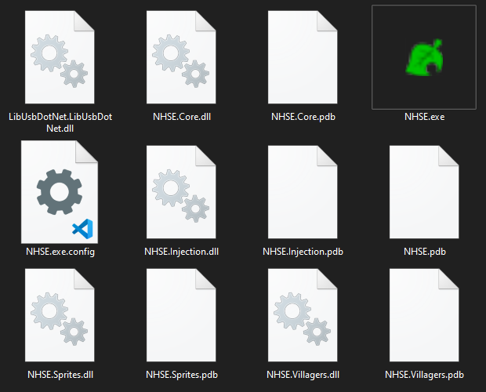

<html>
 <head>
  <meta name="description" content="A guide for NHSE, the most popular New Horizons Save Editor!">
  <title>NHSE Guide</title>
</head> 
</html>

# NHSE

## What is NHSE?

`NHSE` (New Horizons: Save Editor) is, as the name suggests, a save editor for New Horizons. It was made by Kurt ([kwsch](https://github.com/kwsch)), written in C# and is the longest standing save editor for NH. [MyHorizons](https://github.com/Cuyler36/MyHorizons) by [Cuyler36](https://github.com/Cuyler36) was (and still is, afaik) the only other save editor for NHSE, however it has been discontinued (once again afaik, there hasnt been a commit in a year)

## Downloading NHSE

There are 2 ways to download NHSE. The easiest is shown first

1. Go to https://berichan.github.io/GetNHSE/, and click the BIG button that says `Download Latest NHSE Version`. This will download a .zip, and inside it will be NHSE and all of the needed files for it. When trying to use it, make sure you **UNZIP THE NHSE.zip** before you try to open the NHSE.exe, otherwise you will get an error.

Everything inside NHSE (as of the time writing this). If your folder does not have everything shown in this screenshot, then you should probably try downloading NHSE again.

 

2. Downloading compiled buids (info taken from [kurts wiki](https://github.com/kwsch/NHSE/wiki/Downloading-Compiled-Builds))

A gif tutorial is shown, to help out a bit

- On [the Github page](https://github.com/kwsch/NHSE), click the green checkmark

- Click "Details" in the popup

- Click "View more details on Azure Pipelines"

- Click the "Published" button under Artifacts

- Click the 3 dots to the right, then click "Download Artifacts"

 

## Using NHSE

In the NHSE.zip you downloaded earlier, there will be a file called `NHSE.exe`. You open this to use NHSE. Do know however that you **DO** need to unzip the NHSE.zip, otherwise you will get an error when you try to open it

This page assumes you already have CFW, and if you don't, then you can follow my own guide here.
