<big>**Table of Contents**</big>

- [What is NHSE?](#what-is-nhse)
- [Downloading NHSE](#downloading-nhse)
- [Opening NHSE](#opening-nhse)
  - [Extracting Save with JKSV](#extracting-save-with-jksv)
  - [Importing Save to NHSE](#importing-save-to-nhse)
- [Using NHSE](#using-nhse)
  - [Internal Items](#internal-items)
- [Players Tab](#players-tab)
  - [**Editing Storage**](#editing-storage)
  - [**Editing Received Items**](#editing-received-items)
  - [**Editing Achievements**](#editing-achievements)
  - [**Editing Recipes**](#editing-recipes)
  - [**Editing Flags**](#editing-flags)
  - [**Editing Reactions**](#editing-reactions)
  - [**Editing Misc**](#editing-misc)
- [Villagers Tab](#villagers-tab)
  - [**Changing Villager**](#changing-villager)
  - [**Changing Villager House**](#changing-villager-house)
  - [**Moving Villager Out**](#moving-villager-out)
  - [**Editing Furniture**](#editing-furniture)
  - [**Editing Wear**](#editing-wear)
  - [**Editing Room**](#editing-room)
  - [**Editing Memories**](#editing-memories)
  - [**Editing DIY Timer**](#editing-diy-timer)
- [Map Tab](#map-tab)
  - [**Editing Turnip Exchange**](#editing-turnip-exchange)
  - [**Editing Recycle Bin**](#editing-recycle-bin)
  - [**Editing Hemisphere**](#editing-hemisphere)
  - [**Editing Airport Color**](#editing-airport-color)
  - [**Editing Designs**](#editing-designs)
  - [**Editing Player Houses**](#editing-player-houses)
  - [**Editing Weather Seed**](#editing-weather-seed)
  - [**Editing Flags**](#editing-flags-1)
  - [**Editing Bulletin Board**](#editing-bulletin-board)
  - [**Editing Field Goods**](#editing-field-goods)
  - [**Editing Museum**](#editing-museum)
  - [**Editing Visitors**](#editing-visitors)
- [**Editing Field Items**](#editing-field-items)
- [Loading Save](#loading-save)

# What is NHSE?

**NHSE** (New Horizons: Save Editor) is, as the name suggests, a save editor for New Horizons. It was made by Kurt ([kwsch](https://github.com/kwsch)), written in C#, and is the longest standing save editor for NH. [MyHorizons](https://github.com/Cuyler36/MyHorizons) by [Cuyler36](https://github.com/Cuyler36) was (and still is, afaik) the only other save editor for NHSE, however, it has been discontinued.

# Downloading NHSE

There are 2 ways to download NHSE. The easiest is shown first

Go to [https://berichan.github.io/GetNHSE/](https://berichan.github.io/GetNHSE/), and click the BIG button that says `Download Latest NHSE Version`. This will download a .zip, and inside it will be NHSE and all of the needed files for it.

<p align="center">
<a href="https://berichan.github.io/GetNHSE/"></a> 
</p>

<sub>Everything inside NHSE (as of the time writing this). If your folder does not have everything shown in this screenshot, then you should probably try downloading NHSE again.</sub>

<p align="center">
 
</p>

Or download compiled builds (info taken from [Kurt's wiki](https://github.com/kwsch/NHSE/wiki/Downloading-Compiled-Builds))

A gif tutorial is shown, to help out a bit

- On [the Github page](https://github.com/kwsch/NHSE), click the green checkmark

- Click "Details" in the popup

- Click "View more details on Azure Pipelines"

- Click the "Published" button under Artifacts

- Click the 3 dots to the right, then click "Download Artifacts"

<p align="center">
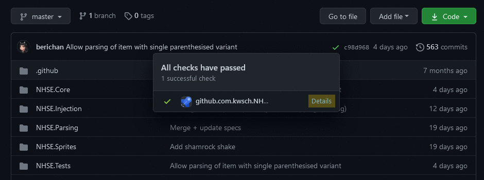 
</p>

# Opening NHSE

Extract the `NHSE.zip` you've just downloaded and open `NHSE.exe`. **You MUST extract the zip to use NHSE**. If you don't, you will get an error that looks a little something like this. If you get this, you know what you did wrong. [You can use 7-zip to extract.](https://www.7-zip.org/)

<p align="center">
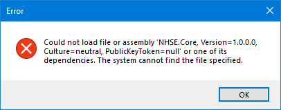
</p>

This page assumes you already have CFW, and if you don't, then you can [follow a guide here.](../switch-guide)

## Extracting Save with JKSV

NHSE is a **Save Editor** (hence the name New Horizons: Save Editor). This obviously means that you're gonna need to extract your save for use with NHSE! JKSV currently is the only homebrew app that can do this. This is because ACNH uses Device Saves, and Checkpoint (another big save extractor) doesn't support this.

---

<big><big>**Before extracting your save, try finishing most of the game. You don't want to rely on NHSE too much to finish it for you, since plenty of errors can come your way if you decide to cheat your way through. Errors that might just completely prevent you from loading your save. If you aren't gonna listen to the big message in front of you, at least make a backup of your save.**</big></big>

---

1. Download the [latest release of JKSV](https://github.com/J-D-K/JKSV/releases).
2. Drag `JKSV.nro` into the `switch` folder on root.
   - No, **not in a folder called `root`**. This [root](https://raw.githubusercontent.com/inconsistent-dg/AC-Modding/main/assets/images/misc/root.png). Open your SD card, and without being in any folders already, you'll see a `switch` folder. **Drag it in there.**
3. Boot into Custom Firmware, then open the Homebrew Launcher. Find JKSV, then open it.
   - You'll be fine opening the HBmenu in the album, but app takeover is still an option.
4. Open `Device Saves`, then ACNH.
5. Press `New...`, and then give your save folder a name.
6. Once finished, open the JKSV folder on your Switch, then the Animal Crossing folder. Whatever you named your folder in step 5 will be there.

Now that you have your save, you can actually use NHSE! You really, *really* should make a backup of the save you just made. You might make a terrible mistake on accident, and then you won't have any save to fallback on. A great man once said, the best backup's the one you **have** but don't need, and the worst backup's the one you **need** but don't have.

## Importing Save to NHSE

Open NHSE, and drag your save folder (from `sd:/JKSV/Animal Crossing  New Horizons`) into the NHSE window. After a couple seconds, it should load, and you'll be ready to edit!

(It's better to drag the entire folder rather than just the `main.dat`.)

<p align="center">
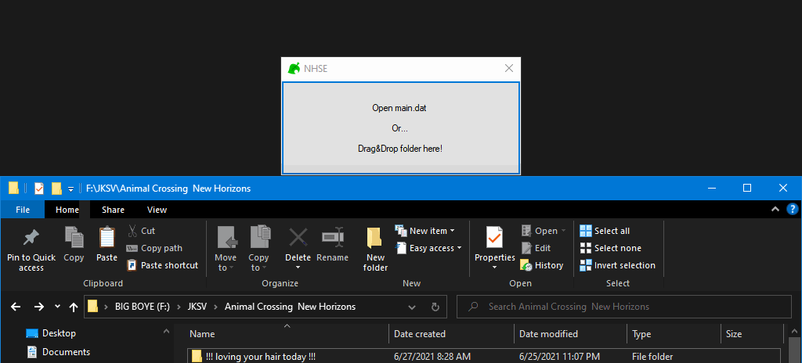 
</p>

# Using NHSE

You're most likely here to do one thing: make a treasure island. [You can click here](#editing-field-items) to see a bit of that process.

## Internal Items

Before going any further, it's important to mention `internal items`. Internal items are items that cannot be obtained by the player during normal gameplay, and only by editing it into your save. Most of them are items that villagers can hold and use, but the player can't (such as a fruit shake). It's important to bring this up because once these items are in your inventory, you ***can't*** get them out of there without editing it out, or deleting your current save and starting over, as some aren't even able to be thrown away. These are cool as decoration, or as a way to just hold a donut in your hand, but you shouldn't try and give these to other players. People on your island shouldn't be able to pick these up, but sending them to your "friends" through the mailbox to mess up their save is just a shitty move.

<big>[**Please read this list by Berichan to see what these internal items are, and prevent yourself from placing them down.**](https://github.com/berichan/ACNHMobileSpawner/wiki/List-of-internal-items)</big>

# Players Tab

<p>
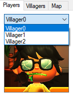
</p>
All of the tabs (including this one) are pretty self explanatory for the most part. Even with a comprehension skill of 3, you should still be able to understand what changing your Player or Town Name does. 

If you have multiple players on your island, you can click on `Villager0` to change between them.

## **Editing Storage**

Clicking on `Edit Player...` and then `Edit Storage` will allow you to edit your storage (no surprise). You can either dump or load an `NHI` (New Horizons Inventory) of your storage to import into other places that allow it. You can press `Clear`, which will delete all items of your choosing. Or `Sort` to sort all your items in alphabetical order, or by the type of item.

<p align="center">
  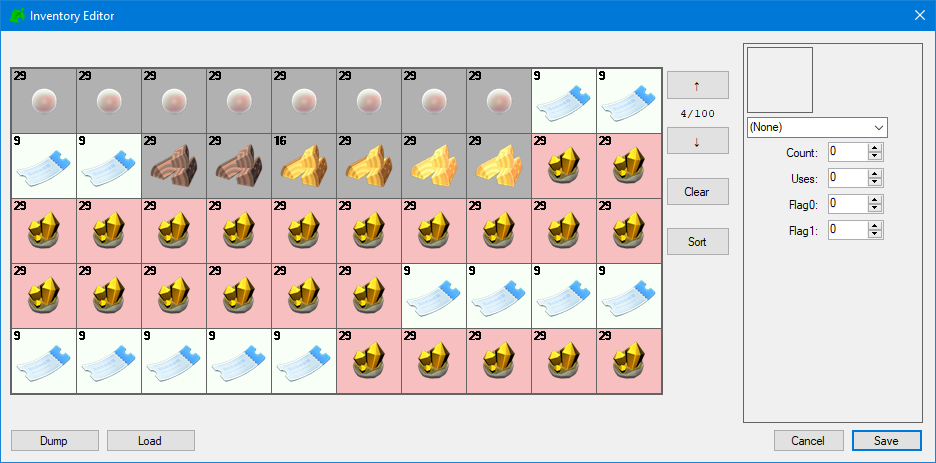
</p>

## **Editing Received Items**

Clicking on `Edit Player...` and then `Edit Received Items` will allow you to edit all of the items you've Received throughout your playthrough. You can click `Give All` to automatically give you every item there, or you can simply check the boxes next to the item name to manually give yourself the item.

It's recommended to earn all these through normal gameplay. But hey, it's not my save that'll be corrupted!

<p align="center">
  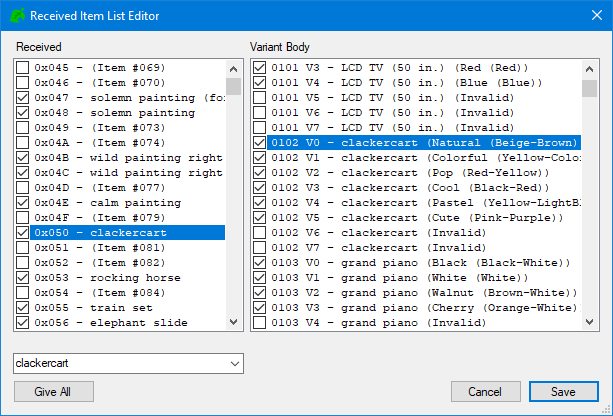
</p>

## **Editing Achievements**

Clicking on `Edit Player...` and then `Edit Achievements` will allow you to edit your achievements. You can click `Give All` which will complete every achievement there, or you can click `Clear All` which will completely erase all achievements you've earned so far. If NHSE doesn't do it for you, you should check each achievement and make sure that `Read` is checked, otherwise you'll have to go through your Nook Miles app and read them all yourself.

Instead of just giving all of these to yourself through NSHE, you should probably get them through normal gameplay.

The achievements aren't named the same way that they are in game, and that's because NHSE uses the internal names for all of them. They're named pretty similarly though, so it shouldn't be too hard to manually give/remove an achievement you want/don't want.

<p align="center">
  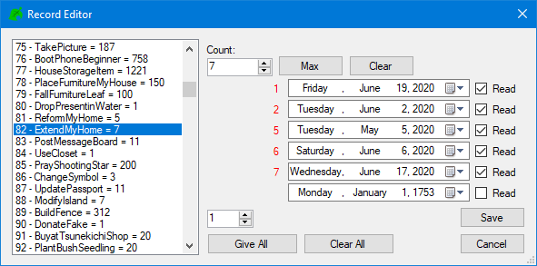
</p>

## **Editing Recipes**

This one should be pretty self explanatory. Clicking on `Edit Player...` and then `Edit Recipes` will allow you to edit your recipes. Using the `goto` dropdown box at the top, you can go to the specific recipe that you want and then click on **Known**, **Crafted**, **Favorite**, or **New** which will give the recipe that property. If you don't want to go through every recipe and add/remove a property, you can select `Learn All`, which will apply the **Known** and **New** properties to that recipe.

It's recommended to earn all these through normal gameplay, instead of just giving them to yourself.

<p align="center">
  
</p>

## **Editing Flags**

Clicking on `Edit Player...` and then `Edit Flags` will allow you to change your player flags. Flags keep track of what you have done/completed during your playthrough. They're true/false statements, 0 being false and 1 being true. So to enable a flag, set it to 1, and to disable it set it to 0. Only change these flags if absolutely necessary. It's best to achieve all flags in-game, as there could be other flags affected during normal playthrough that aren't known about right now, which could potentially mess up your save. Some flags aren't fully working anymore either, and might softlock it. So if you do have to change them, ***make a backup.***

```
Terraforming:                  513, 565-574, 644
Designer app:                  513
Paving:                        828
3 Star Evaluation / KK Unlock: 776
5 Star Evaluation:             692
Harvey's Island:               535, 544
Reactions UI:                  140
Pro Designs:                   353, 702, 714
Pro Designs+:                  1172
Custom Design Portal:          1310
Nook Shopping App:             319
Hair styles:                   559-562
Hair Color:                    563
Halloween Customizations:      1142-1144
Afro Hairstyles:               1219
Incline/Bridge Kit Dialog:     126 (set to 4)
```

<p align="center">
  
</p>

## **Editing Reactions**

Clicking on `Edit Player...` and then `Edit Reactions` will allow you to edit your reactions. Click the arrow next to **ManpuBit**, and you'll be able to see all the reactions that you've gotten so far. Clicking on the arrow next to the reaction will allow you to change the reaction to whatever you want. If you want to use the UNUSED reactions, there is a list below.

```
UNUSED_6  = Anger
UNUSED_8  = Outrage
UNUSED_17 = Disbelief
UNUSED_34 = Sweating
UNUSED_37 = Smile
UNUSED_38 = Sunniness
UNUSED_46 = Shrunk Funk Shuffle
UNUSED_49 = Distress, no hand movement
UNUSED_50 = Smiling and rubbing cheek
UNUSED_51 = Poking hands
UNUSED_52 = Intense frowning!
UNUSED_53 = Amazed, smaller particles
UNUSED_56 = Talking
UNUSED_57 = Clapping, no expression
UNUSED_59 = Greetings, no expression
UNUSED_75 = Gulliver (dead)
UNUSED_76 = Intense shake action!
UNUSED_77 = Roll safe!
UNUSED_78 = Leave it to me!
UNUSED_79 = K.K. Slider, Sitting
UNUSED_80 = K.K. Slider, Sitting while nodding
UNUSED_81 = K.K. Slider, Sitting while thinking
```

<p align="center">
  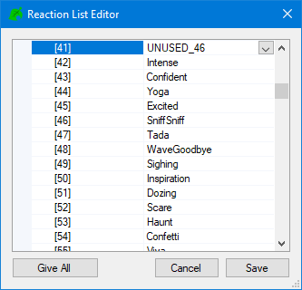
</p>

## **Editing Misc**

Clicking on `Edit Player...` and then `Edit Misc` will allow you to change some player settings that don't fit anywhere else. These things being your birthday, the day that you started playing, your island fruit, and whether or not the character you've chosen created the island. Most of these are self explanatory, but know that changing your island fruit from here will only change it on your passport. Because of this, everywhere else it will refer to the old fruit. [Click here to see how to change the fruit everywhere](https://gbatemp.net/threads/animal-crossing-new-horizons-reverse-engineering-glitches-bugs-etc-thread.560199/page-389#post-9468816).

The **Made Village** option is given to the Island Representative. To change it, simply untick the box, then go to the villager that you want to give it to. *I haven't tested what it's like to tick the box on multiple representatives....*

<p align="center">
  
</p>

# Villagers Tab

<p>
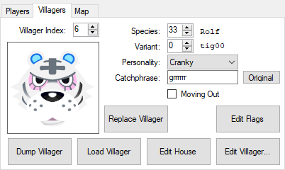
</p>

The villagers tab shows all the villagers you have on your island, along with their relationship with you, their catchphrase, personality, and everything else you'd expect to see from a save editor. You can change which villager you'd like to edit by changing the villager index. It's recommended to finish the game (get all 10 villagers) before editing *anything*, but especially with villagers. 

## **Changing Villager**
You *could* change the villager by editing the species and variant, however it is not recommended to do it this way. There are a lot of flags different villagers have, so it's recommended to use the Villager Database instead to import villagers.

[Download the villager database here](../assets/Villager-Database.7z). You MUST extract the zip to use with NHSE. [You can use something like 7-zip to extract](https://www.7-zip.org/). Once extracted, you will see a list of ALL villagers in the game, along with their houses. 

<p>
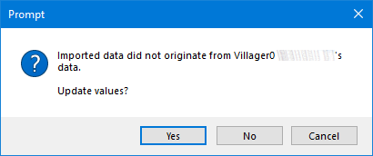
</p>

In NHSE, click on **Load Villager**. Now go to the location where you extracted the Villager database, and open it. Find the villager you want to replace them with, and select it. You'll get a prompt saying the villager didn't originate from your Island representative, so click **Yes** when it asks you if you want to update the values.

Your villager is changed! ...but what about the house?

## **Changing Villager House**

Because the villager house is separate from the villager itself, you will have to import that as well. Be sure to save (File > Save) before changing continuing, as the villager name may not be correct if you don't. Anyway, click **Edit House**. Click on **Load** at the bottom, go to the Villager Database, and open it. Find the villager's house (`nhvh`) and select it. It will change the house values correctly, so the house is now fixed. Before saving, make sure that the **NPC1** number is set to the right villager index. For example, if you're editing Rolf whose villager index is 6, you want to make sure that the NPC1 number is also set to 6.

## **Moving Villager Out**
If you have a keen eye, you might've noticed already that there's a **Moving Out** box to the right of the villager. Checking this will put the villager in boxes, to allow someone else to pick them up. But, when checking it, you will get an error that looks something like this.

<p align="center">
  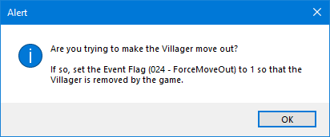
</p>

There are 2 ways you can get your villager to move out, or be in boxes. There's a Forced Move Out, and an Irregular Move out. The Forced move out is the "cleaner" method of moving villagers out, and works as it should in the normal game. The villager will be in boxes, and by the next day, whether invited by a visitor or not, the villager will be gone. 

The Irregular move out is the "dirtier" method. It will keep the villager in boxes *forever*, meaning that even if a day passes without a player picking them up, they will still be there tomorrow. And the next day. *And the next day*. ***And the next day***. So, forever. This is great if you run a treasure island, and don't want to revert the time every day, or if you're a "normal" player who wants to trade a villager, but don't know when a visitor is coming.

Setting the flag (024 - ForceMoveOut) to 1 works as a forced move out (hence the name.) If you want your villagers to stay in boxes forever, don't set the flag. Only checking the box acts as an irregular move out.

<big>Edit Villager</big>

## **Editing Furniture**

Clicking on `Edit Villager` and then `Edit Furniture` will allow you to... change furniture? I believe this is furniture that will randomly be given to you when your friendship with the villager is high enough. I'm not exactly sure though, so I can't say for certain.

## **Editing Wear**

Clicking on `Edit Villager` and then `Edit Wear` will allow you to change the clothes your villager will wear. Simply search for the clothing item, place the clothing in the inventory, then save.

## **Editing Room**

Clicking on `Edit Villager` and then `Edit Room` will allow you to edit your villager's room. You can edit the accent wall, the wall itself, and the floor of the house. Just click on which you'd like to edit, and it will bring up a prompt where you can search for what you'd like to change it to. I'm not sure what changing the direction or InfoBit does, but you can try it and see.

## **Editing Memories**

Clicking on `Edit Villager` and then `Edit Player Memories` will allow you to edit the flags of what the villager knows about you. For example, how many days in a row have you spoken to the villager, how many times you've spoken to them in one day, if you've set their greeting/nickname, WHAT you've set their greeting/nickname to, and so on.

<p align="center">
  
</p>

## **Editing DIY Timer**

Clicking on `Edit Villager` and then `Edit DIY Timer` will allow you to set when your villager is crafting a DIY recipe, what the recipe will be, and how long they will be crafting the recipe for. This can be used if you want a player to get a DIY from a villager instead of injecting it in your inventory or on your island.

# Map Tab

<p>

</p>

The Map tab allows you to edit most of the information regarding your map, such as your Hemisphere, Airport Color, Weather Seed, and so on. Despite my warning for changing anything else, there's not much bad that can be done by changing these values. This doesn't change the fact that any editing that's done could potentially mess up the save, so I'll say it again in case you missed it: **TRY FINISHING THE GAME FIRST BEFORE SAVE EDITING!!** And make backups UwU

## **Editing Turnip Exchange**

<p>
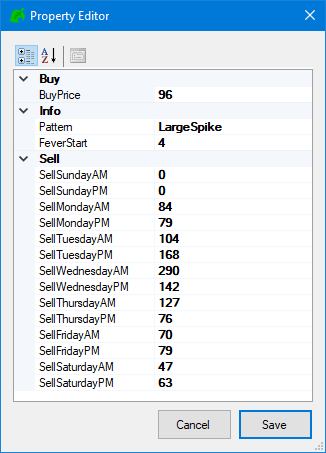
</p>

The turnip exchange is probably one of the best things in this game. It could be argued that it's the best way to earn money. It's also the best way to *cheat* money! Just click on `Edit Turnip Exchange` to edit it.

Looking on the right, you can see that I have some pretty good prices for my normal, nonedited save on Wednesday! It just proves my theory that Wednesday is one of the best weekdays. But, this isn't what I'm making this guide for. You can edit the prices to whatever you feel like to give yourself (or your visitors) the most bang for their buck. The turnip limit in the base game is 660(?) so if you wanted to create the illusion that you're a normal player that just got lucky you can change it to this. But, there's also a glitch that allows visitors to completely MAX OUT their ABD, giving them **999,999,999** bells. 

I'm sure you're already familiar with the glitch that gives any visitor a maxed out ABD (999,999,999 bells). If you aren't though, I'll explain it.

Basically, the turnip glitch is an overflow error in the game. I'm not going to get into detail here, you can look it up if you're interested. But something is set incorrectly, and due to the overflow max bells are sent.

Before attempting this, make sure that you set your switch time to a **Monday**. Any other day of the week could be used (excluding Sunday) but setting it to Monday allows for 6 days of no resetting. Now make a dump of your save on Monday.

You (or your visitors) need to sell exactly **30 turnips** for this to work. Do **NOT** type `turnips` into NHSE, type in **30 turnips** and spawn that instead. When you (or the visitor) sell, they'll see a sum of `-64,771,104` bells. If they do not see this, then they did not sell 30 turnips. But if you do, accept the trade, and in your ABD  you will see max bells.

Set your values to this.

<p align="center">
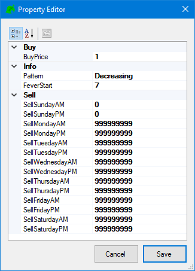 
</p>

## **Editing Recycle Bin**

On the Map tab, select `Edit Recycle Bin`. There's not much to say about the recycle bin, other than that it stores dropped items on the island or from your villagers. When in the recycle bin, you can "borrow" the items within it, to keep for yourself.

<p align="center">
 
</p>

## **Editing Hemisphere** 

This one is one of the most self explanatory on this entire website. On the Map tab, to your right, you will see a dropdown menu including both the Northern and Southern hemispheres. Select the one you want to use.

## **Editing Airport Color** 

I *was* going to also say this one was self explanatory, but maybe not? On the Map tab, next to `Edit Airport Color`, you will see a dropdown menu for airport colors. You can choose between them, changing your airport color (obviously).

The only thing *not* obviously explained here is why changing the airport color from this menu doesn't also change the colors of the various airport-themed items you can redeem. So this change would only be visual, not down to the core level. You will have to change flags somewhere in the game to do this, but it is not documented where this change would be and what to change it to for different airport colors. So for once, you'll have to do your own digging! When you find it, please be sure to contact me so I can add this information.

## **Editing Designs** 

On the Map tab, select `Edit Patterns`, it's pretty much self explanatory what editing this does, it allows you to edit your patterns. You aren't able to make them, but you can dump/import them to give to other people or just as a backup of your own patterns. If you *were* looking for a way to make some yourself, without making them on the Nintendo Switch, you can [check out this website](https://acpatterns.com/editor).

With NHSE, you are only able to dump or import as **.nhd** though. These files are formatted the same way as **.ACNH** files though on the [acpatterns.com](https://acpatterns.com/editor) website, so you can just rename the file to .ACNH/.nhd and you will be able to import/dump and still have them work.

<p align="center">
 
</p>

<big>**Editing PRO Designs**</big>

On the Map tab, select `Edit PRO Desings`, "it's pretty much self explanatory what editing this does, it allows you to edit your" PRO designs. "You aren't able to make them, but you can dump/import them to give to other people or just as a backup of your own" PRO designs. "If you *were* looking for a way to make some yourself, without making them on the Switch, you can [check out this website](https://acpatterns.com/editor)."

"With NHSE, you are only able to dump or import as" **.nhpd**" though. These files are formatted the same way as **.ACNH** files though on the [acpatterns.com](https://acpatterns.com/editor) website, so you can just rename the file to .ACNH/".nhpd" and you will be able to import/dump and still have them work."

<big>**Editing Flag Design**</big>

On the Map tab, select `Edit Flag Design`, "it's pretty much self explanatory what editing this does, it allows you to edit your" Flag design. "You aren't able to make them, but you can dump/import them to give to other people or just as a backup of your own" Flag designs. "If you *were* looking for a way to make some yourself, without making them on the Switch, you can [check out this website](https://acpatterns.com/editor)."

"With NHSE, you are only able to dump or import as **.nhd** though. These files are formatted the same way as **.ACNH** files though on the [acpatterns.com](https://acpatterns.com/editor) website, so you can just rename the file to .ACNH/.nhd and you will be able to import/dump and still have them work."

<big>**Editing Tailor Designs**</big>

On the Map tab, select `Edit Tailor Designs`, "it's pretty much self explanatory what editing this does, it allows you to edit your" PRO designs. "You aren't able to make them, but you can dump/import them to give to other people or just as a backup of your own" PRO designs. "If you *were* looking for a way to make some yourself, without making them on the Switch, you can [check out this website](https://acpatterns.com/editor)."

"With NHSE, you are only able to dump or import as" **.nhpd**" though. These files are formatted the same way as **.ACNH** files though on the [acpatterns.com](https://acpatterns.com/editor) website, so you can just rename the file to .ACNH/".nhpd" and you will be able to import/dump and still have them work."

## **Editing Player Houses** 

On the Map tab, select `Edit Player Houses`. It allows you to edit your house.

You can change your house level, the interiors of your house, the exteriors, the loan, so on so forth. Despite this, it's still recommended to just pay the loan to Nook, so you can upgrade your house normally. You can already literally give yourself items, why not?

<p align="center">
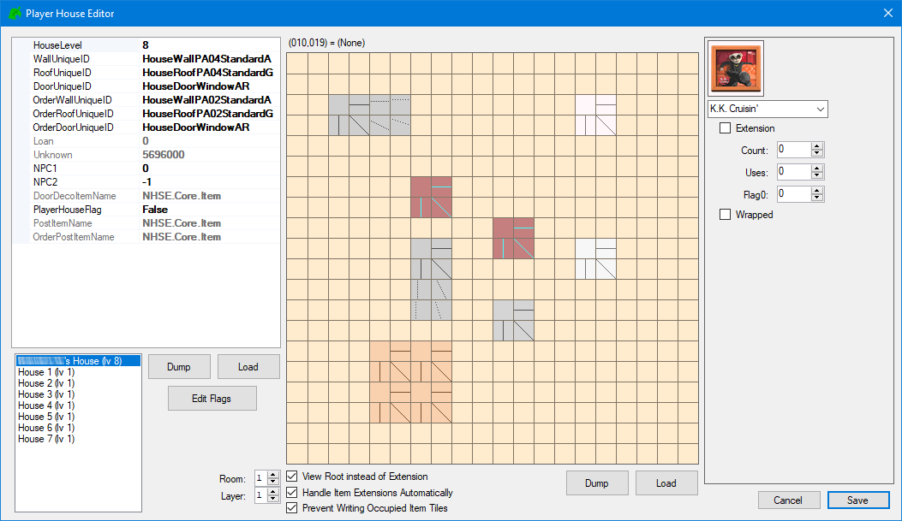 
</p>

## **Editing Weather Seed**

Let's start by asking what a weather seed is in the first place.

Every save has a different **Weather Seed**, and this seed determines the weather that you will receive during your playthrough (kinda like Minecraft). This weather seed will *never* change during normal gameplay. Because the weather seed has already preset what your weather will look like, you can't just *make it start raining*, or *make it snow*. You will have to follow the weather seed, or find one which has the weather you're looking for. The only way to get the weather that you're looking for is to take the weather seed, then, with a tool, you can look at the determined weather and time travel to the day with the "snow" or with some "rain" or whatever else you're looking for. Normal players can also *calculate* their weather seed, but this is not always accurate. Remember, there are over **2 BILLION** possible weather seeds, unless you can actually check there's no knowing if it's correct.

Knowing your Weather Seed can also help if you just want to spawn in Celeste or any other random visitors whenever you'd like.

Anyway, go to [https://wuffs.org/acnh/weather/](https://wuffs.org/acnh/weather/), and click on `Overview` at the top. When you're here, fill in your weather seed, along with your Island Name if you feel like it. For example, my Weather Seed is `4202545829`, and my island name is `Pog Island`(©) so this is what I copy into the site. It is also very important to copy if you're hemisphere is Northern or Southern, so be sure to do so. Once set, select Save settings and you're ready for the next step!

<p align="center">
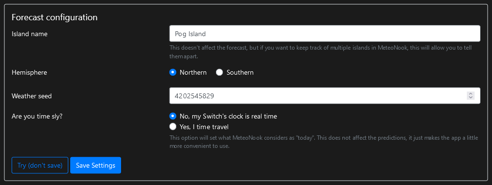 
</p>

 

After filling this information in, you'll get your weather pattern. You can check the weather pattern by clicking on **Yearly** or **Monthly** at the top. Selecting a date will give you more information on the weather recorded on that day, like when exactly star showers will start, when it will rain and when it'll stop, and so on. You can then time travel to that date on your Switch and the weather will be there.

If you wanted Celeste on your island with stars, find the day that you'll have them through Ninji's tool. To actually get Celeste to show up, in NHSE, click the `Edit Map` button then click `Edit Visitors`. Get the day of the meteor shower, and set the index of that day to `DayCeleste`. The day count starts from 0, so Sunday is 0, Monday is 1, and so on. So, if you have a meteor shower on Thursday and want Celeste to be there, set the Index to 4. Save, load, and they'll be there!

<big>**Edit Map...**</big>

## **Editing Flags** 

Clicking on `Edit Map...` and then `Edit Flags` will allow you to change your map flags. Flags keep track of what you have done/completed during your playthrough. They're true/false statements, 0 being false and 1 being true. So to enable a flag, set it to 1, and to disable it set it to 0. Map flags aren't actually extremely looked into that much (like most other flags) so there isn't a list of what most of them do. 

No matter what though, as always, it's best to achieve all flags in-game, as there could be other flags affected during normal playthrough that aren't known about right now, which could potentially mess up your save. 

## **Editing Bulletin Board** 

Clicking on `Edit Map...` and then `Edit Bulletin Board` will allow you to edit your Bulletin Board. The bulletin board is one of the best ways to keep up with events happening on your island, or it can be abused to make villagers say things that were never meant to be said or drawn.

There are 2 bulletin board posts, a drawn one and a text one (or both). You can painstakingly ***try*** to make a drawn post in NHSE, or watch a [video by Klutch, explaining how to use Pixel Press](https://www.youtube.com/watch?v=EI1d-wky0TQ). Pixel Press is an app that will draw any image you give it, on your own island or someone else's. Check it out! It was made by my buddy Katsching.

<p>
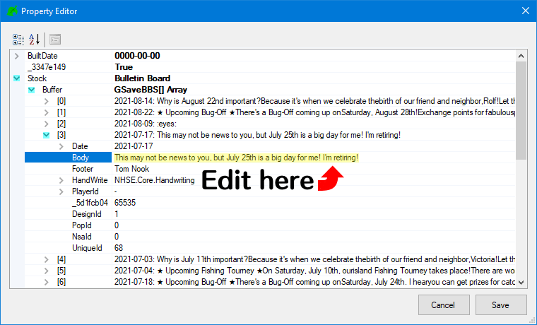
</p>

Editing the text is very simple though. In the Bulletin Board editor, under Stock -> Buffer, you will be able to see all of your *current* bulletin board messages (it's not possible to create new ones unless in game). You can edit the date of the posts by editing the array, or edit the body text by opening the dropdown box next to the post and editing the Body. You can write basically anything here, and I'm pretty sure you can go past the limit in the base game (though I haven't tested this). 

<p align="center">
  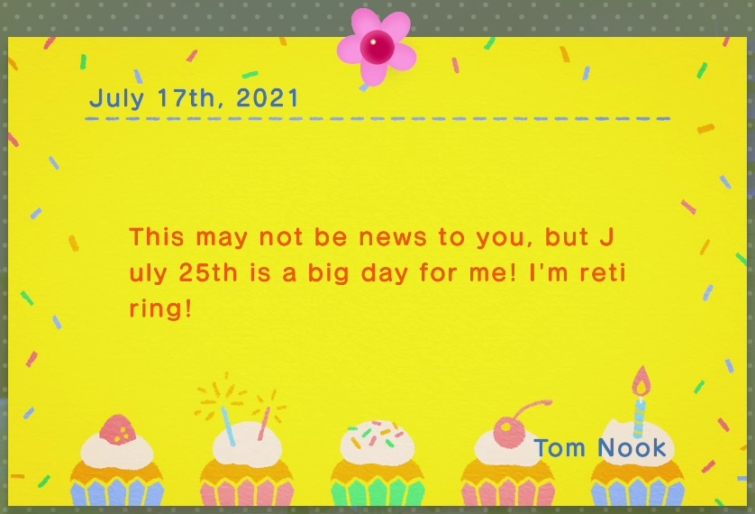
</p>

<p align="center">
If you do edit the bulletin board, remember to use linebreaks.
</p>

## **Editing Field Goods** 

Clicking on `Edit Map...` and then `Edit Field Goods` allows you to edit your field goods. <span data-audio-url="../assets/misc/frank.mp3" data-audio-url="../assets/misc/franker.mp3" data-audio-url="../assets/misc/frankerfz.mp3">I'll be frank,</span> I'm not sure what some of these do. Though changing your native fruit was touched up on earlier in the guide, in the [Editing Misc...](#editing-misc) options.

<script>
$("[data-audio-url]").each(
    function(){
        $(this).on('click', function() {
            var mp3Url = $(this).attr('data-audio-url');
            var a = new Audio(mp3Url);
            a.play();
        });
    }
);
</script>

## **Editing Museum** 

Clicking on `Edit Map...` and then `Edit Museum` allows you to edit your museum. You can edit the date you turned in a critter, what the critter was, and which villager turned it in.

## **Editing Visitors** 

Clicking on `Edit Map...` and then `Edit Visitors` allows you to edit the visitors that will come to your island. This was already touched up upon earlier in the guide, in the [**Editing Weather Seed**](#editing-weather-seed) section. Just go there for more information ❤

# **Editing Field Items** 

Clicking on `Edit Map...` and then `Edit Field Items` allows you to edit the items on your field, or island. Most people who use NHSE use it for this function, as it allows them to create treasure islands.

# Loading Save

1. After you have made your changes in NHSE, go to `File > Save`, or simply press "Ctrl + S". This *will* overwrite the data from the save you imported, **make sure you have a backup.** If you copied the save from your SD to your PC, follow step 2. If you've dragged the save folder from your SD, skip to step 3.
2. Drag the save from your PC to `sd:/JKSV/Animal Crossing  New Horizons`.
3. Open JKSV, select Device Saves, then Animal Crossing.
4. Your save should be in here. Select it with the DPAD, then press Y on it. Hold A to confirm you want to restore it.
5. Boot into ACNH, and the save should be loaded.

If your changes don't show up in game:
- You didn't restore
- You forgot to save in NHSE
- You put the save in the wrong directory
- You made changes unable to be shown (e.g. adding removed 1.4 items)
