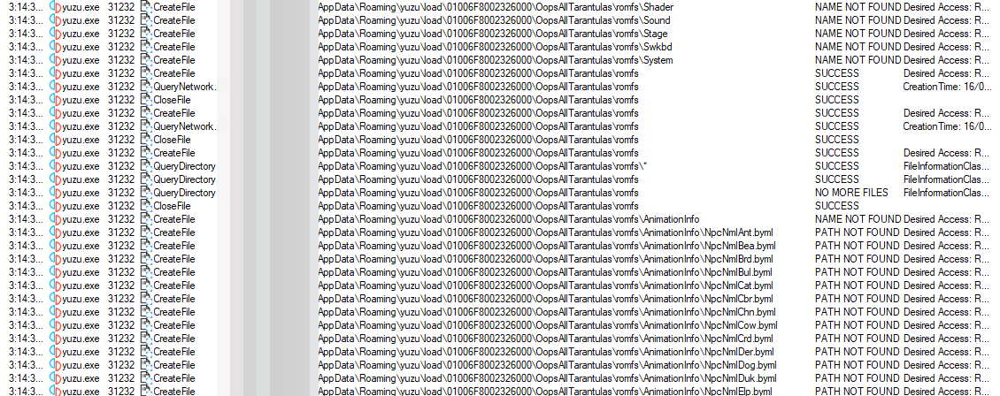

Using an emulator for Animal Crossing can be useful in many cases. You might emulate to upscale NH to 4k as the console and [SysDVR](../SysDVR) limit it to 720p, or you might use it as creating/loading mods is easier on it.  
There are 2 emulators for the Switch, these being **Yuzu** and **Ryujinx**. Both have their pros and cons.

Yuzu doesn't require you to have a top end device, so it's more compatible with lower end computers. Conversely, Ryujinx is more CPU intensive. Yuzu, sadly, is not very ACNH compatible. It requires custom patches for glitches (like fog appearing black), *and* **LayeredFS** is barely supported. If any LayeredFS mods are loaded for ACNH with Yuzu, it can then take anywhere from 10 minutes to 10 hours for it to load. Sometimes, it just won't. [Why is explained here](#why-yuzus-layeredfs-is-bad). Ryujinx doesn't have these problems.

| **Emulator** | **Description**                                                                   | **Compatability**                                                                                                                                                                                                                            | **Recommended?** | Download                        |
|--------------|-----------------------------------------------------------------------------------|----------------------------------------------------------------------------------------------------------------------------------------------------------------------------------------------------------------------------------------------|------------------|---------------------------------|
| **Ryujinx**  | More accurate and less hacky, but at the cost of performance. More CPU intensive. | Supports Windows and Linux. macOS support planned.   No visual errors. Supports LayeredFS mods.                                                                                                                                           | ✔️               | https://ryujinx.org/download    |
| **Yuzu**     | Better performance, good compatibility with lower end devices.                    | Supports Windows and Linux. macOS support planned.   Requires custom patches for glitches like fog appearing black, and crashes like the camera bug.   Supports LayeredFS mods, however load times can increase upwards of 10 minutes. | ❌                | https://yuzu-emu.org/downloads/ |

a lot of information was taken from the [**yuzu**](https://yuzu-emu.org/help/quickstart/) and [**ryujinx**](https://github.com/Ryujinx/Ryujinx/wiki/Ryujinx-Setup-&-Configuration-Guide) guides

---

<big>**Table of Contents**</big>

- [Downloading Yuzu](#downloading-yuzu)
- [Downloading Ryujinx](#downloading-ryujinx)
  - [Minimum/Recommended Specs](#minimumrecommended-specs)
- [Why yuzu's LayeredFs is bad](#why-yuzus-layeredfs-is-bad)

---

# Downloading Yuzu

For now, follow the [Yuzu quickstart](https://yuzu-emu.org/help/quickstart/) guide while I finish this page.

# Downloading Ryujinx

For now, follow the [Ryujinx wiki](https://github.com/Ryujinx/Ryujinx/wiki/Ryujinx-Setup-&-Configuration-Guide) while I finish this page.

## Minimum/Recommended Specs

The specifications here don't guarantee BEAUTIFUL full speed gameplay, but instead they layout a cost effective recommendation while still taking into account the performance

|                 | **CPU**                                | **GPU**                                                                          | **RAM** |
|-----------------|----------------------------------------|----------------------------------------------------------------------------------|---------|
| **Minimum**     | Intel Core i5-4430 / AMD Ryzen 3 1200  | Intel HD Graphics 520 / NVIDIA GeForce GT 1030 2GB / AMD Radeon R7 240 2GB       | 8GB     |
| **Recommended** | Intel Core i5-10400 / AMD Ryzen 5 3600 | Intel UHD Graphics 630 / NVIDIA GeForce GTX 1650 4GB / AMD Radeon RX Vega 56 8GB | 16GB    |

# Why yuzu's LayeredFs is bad

thanks to Jess from the acmods.org wiki

Loading mods with Yuzu can take anywhere from 10 minutes to 10 hours, and this is because of how Yuzu attempts to load them.  
This is what procmon shows when Yuzu loads the game with layeredFs:

  

Yuzu looks at the mod directory and says "Does this file exist? Does this file exist? Does this file exist?"  
What it could do is look only at files that exist in the mod directory, and return false for everything else. That would make it load faster, as it wouldn't have to check each individual file in the games romFs.