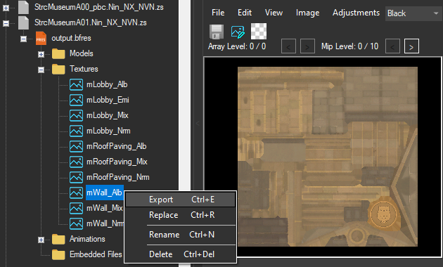
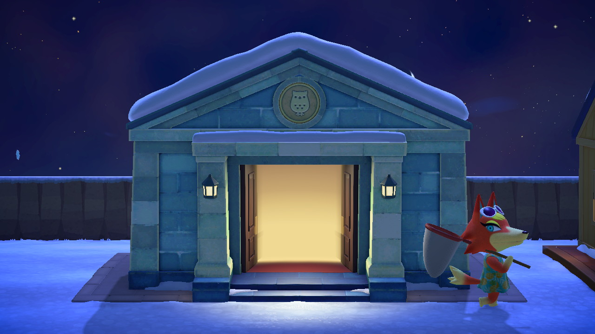

In each models bfres, there is a folder called *Textures*. As the name suggests, this folder contains every texture the model uses. There are multiple types of textures, but the one you're going to edit will probably be the alb. 

- [Texture Types](#texture-types)
- [Editing textures](#editing-textures)

# Texture Types

There are many types of textures in the game, those being:
- Alb
- AlbOry
- Emi
- EmiOry
- Grd
- Mix
- Nrm

And probably more.

kredit to kkclue for descriptions of some textures 💙

**Alb** (albedo) textures are the ones you'll most likely be editing. They represent what is actually rendered on the model. 

I have no clue what AlbOry textures are for 🥴

  

**Emi** textures control the amount of light that is emitted from structures, like the Nooks Cranny, Museum, Able Sisters, etc. EmiOry do the same.

  

**Grd** (gradient) textures are just that, gradients.

  

**Mix** textures control the light reflection, how shiny it is. A good example of this is Kid Cat's helmet. 

  

**Nrm** textuers give depth to the model. The game can go without a normal texture, but without one the model looks very flat.

  

# Editing textures

With the texture you want to replace, right click it and select Export. Change the extension to PNG, then copy it to a directory of your choosing.

  

In whatever image editor you use, make and save your changes.

  

In Switch Toolbox, right click the same texture you exported and click Replace. Go to the directory with the changed texture, and select it. Keep everything the default when importing.

Now, right click the archive with the edited texture and save it. As usual, it *must* be named the same, and be compressed with ZSTD. 

  

Like any other mod, the file must go into the [layeredFs folder](../mods#loading-mods). And the edited archive must be in the same folder as in the romFs. This guide edited the `StrcMuseumA01.Nin_NX_NVN.zs` found in the Model folder, so it must be in the Model folder for the layeredFs.

  

