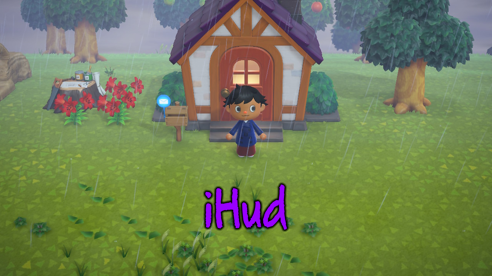
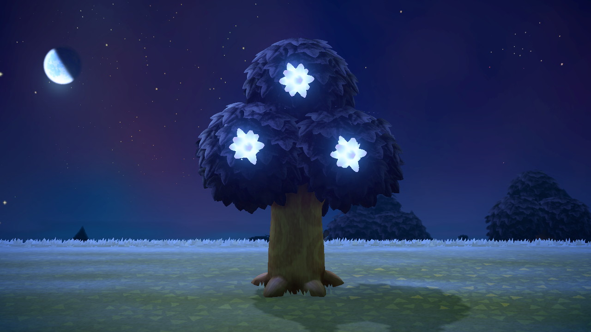

You should probably know how to install mods by now, but if not:<br>
Extract the zip or 7z file you get after downloading, and merge the atmosphere folder from the zip to your Switch. You should NOT have two atmosphere folders (one inside the other).<br>
Your directory should look something like this: `atmosphere\contents\01006F8002326000\romFs\*Mods*`

# iHud

 
This mod completely hides the hud (map, phone, time and date). Great for screenshots and cinematic videos.<br>It's a small and simple BCSV edit.

## How does it work?

In PlayerStateParam.bcsv, the HideHud's (hash `5681a1c3`) functionality is to hide the hud when entering a certain state. Things like using a tool, moving furniture, and sitting down on stumps hide the hud by default.

This mod hides the hud in every state, so even when idling you don't see anything.<br>And if you're asking why not to use the camera, it doesn't follow you when you walk away, and it doesn't allow you to actually play the game with the HUD hidden.

<big>[**📁 Download Here**](../../assets/mods/iHud.zip)</big>

# Star Trees Over Fruit

 
This mod changes the growth of all fruit trees into star fragments. 

You can [request for a custom version](../../contact) of the mod if you want another type of fragment, or if you only want one type of tree to have stars.
Read below to see what each fruit tree turns into:

```
Apple  : Capricorn
Cherry : Cancer
Coconut: Taurus
Orange : Scorpius
Peach  : Normal Star Fragment
Pear   : Large Star Fragment
```

## How does it work?

In FgMainParam.bcsv, the NutItem's (hash be17c845) functionality is to state the item ID
that something else grows up into. 
E.g. sapling -> tree stage 1, red cosmos stems -> red cosmos buds, etc.

This mod changes the item ID that each fruit tree has when fully grown, so instead of
the apple ID (2213) I change it to the capricorn ID (5985).

And no, this isn't a model swap, this changes the actual item that fruit trees grow (so yeah you can pick up the dropped star frags, and they will grow back in time)

<big>[**📁 Download Here**](../../assets/mods/Star-Trees-Over-Fruit.zip)</big>

[**📁 Download Here**](../../assets/mods/Star-Trees-Over-Fruit_12546loveVer.zip) (Heart crystal over apple ver.)