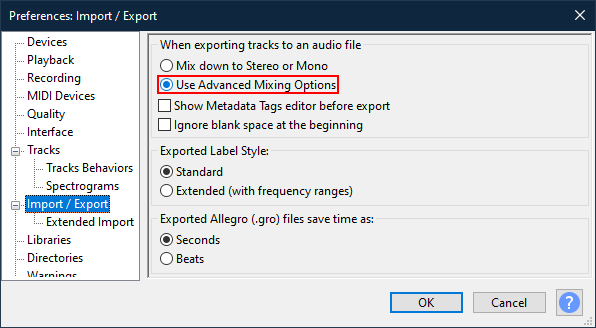
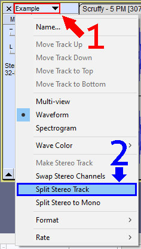
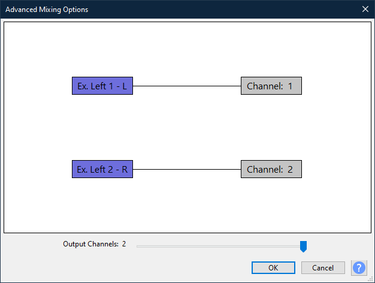
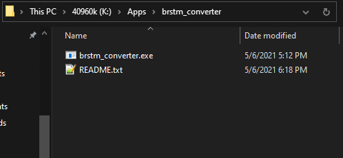

<sub>This page is not fully completed.</sub>

Music in this game is stored in **BWAV** (Binary Wave) files. All music can be found in the *Sound* directory of the games romFs, [which you've hopefully dumped before](../mods#dumping-romfs). This page goes over how to mod custom music into the game, and how to extract audio from bwav to normal wav.  

<big>Table of Contents</big>
- [Creating BWAV (in Citric Composer)](#creating-bwav-in-citric-composer)
  - [Split Stereo Track](#split-stereo-track)
  - [Conversion](#conversion)
  - [Loop Points](#loop-points)
- [Creating BWAV (in Open Revolution)](#creating-bwav-in-open-revolution)
  - [Split Stereo Track](#split-stereo-track-1)
- [BARS Patching](#bars-patching)
- [Extracting Tracks](#extracting-tracks)
    - [K.K. Music List](#kk-music-list)

# Creating BWAV (in Citric Composer)
If the song you want to replace already exists in another game, like New Leaf, then you can go to [smashcustommusic.net](http://smashcustommusic.net/). It provides pre-made files in BWAV to import into other games. If your song can’t be found however, you’ll have to create your own. You can do this two ways.

Open Revolution, or Citric Composer with the Looping Audio Converter.
Open Revolution is a CLI app, but works on Windows, Arch Linux and Mac.
Citric Composer and Looping Audio Converter are GUI apps, but work on Windows only. If you want to use Open Revolution, [skip to this section](#creating-bwav-in-open-revolution).

Download [Looping Audio Converter](https://github.com/libertyernie/LoopingAudioConverter/releases). You’ll also need to download [Audacity](https://www.fosshub.com/Audacity.html) from this link. Download the version corresponding to your OS. The last thing you need is [Citric Composer](https://gota7.github.io/Citric-Composer/), which turns songs into BWAV’s, or extracts songs from the game. Go to this link on screen, and download the Citric Composer Installer. Follow the default settings throughout the installation.

Extract the Audacity zip and open the app. Go to **Edit > Preferences**, and select **Import/Export**. Make sure **Use Advanced Mixing Options** is checked. All songs, excluding KK sliders, have 2 channels. For your song to play correctly, it needs the right amount of channels, which is 2. If you’re replacing a KK slider song, skip this section, as you don’t need 2 channels.

<p align="center">
 
</p>

## Split Stereo Track
<p>
 
</p>
With the song you want to import, drag it into the Audacity window. Select the track, then select **Split Stereo Track**. This will give you 2 channels. 
Since your song might be a bit too loud when imported into the game, press CTRL + A, go to **Effects**, and select **Limiter**. Choose Soft Limit as your type and change the limit to -5dB. Now go to **File > Export > Export as MP3**. Save it wherever you’d like. Make sure there’s 2 output channels, the left connecting to the right, and export.
<p>
 
</p>

## Conversion
Now, extract the zip of the Looping Audio Converter and open the app. Add your song to the list at the top. If you want to convert multiple songs, then you can add them the same way. Change the output format to **BCSTM**, and then hit start.  All songs will be in the output folder of Looping Audio Converter. Double click on the file, and it should play in the Isabelle Sound Editor. Ensure it has two channels by expanding the Channels section. 

## Loop Points
Some songs in the game have loop points. This means that a portion of the song will be heard once, but when the song repeats it will not be heard again. If your song loops normally from start to end, then you don’t have to worry about this. But if it doesn’t, you can use the Green slider on the left and Red slider on the right to make loop points for you. The green segment is the beginning of the song that does not loop, it only plays once. The red slider is for the end of the song, and the end of the loop. If your song doesn't have a fade out or a silent period at the end, you shouldn't have to change the red slider. 
With your loop points set (or not) click File > Export Binary. Make sure to have it named the same as in the games romFs, or the song will not load. I recommend putting the song in a separate folder, to have a backup of the original.

Using the layeredFs folder that you [should’ve created here](../mods#loading-mods), put your custom bwav into the same directory as in the romFs. For example, if you're replacing the BGM_Title.bwav, then you'd place it in Sound/Resource/Stream of the layeredFs.

# Creating BWAV (in Open Revolution)
If you're on Windows, download [Open Revolution here](https://github.com/ic-scm/openrevolution/releases). <br> If you're on Arch Linux, download it from the [Arch User Repository](https://aur.archlinux.org/packages/openrevolution-git/). <br> If you're on MacOS, install it with Homebrew through [freeapp2014/stuff](https://github.com/FreeApp2014/homebrew-stuff).

Open Revolution requires a .wav as its input. If your song is not a wav already, download [Audacity](https://www.fosshub.com/Audacity.html) from this link. Download the version corresponding to your OS. Open the app, go to **Edit > Preferences**, and select **Import/Export**. Make sure **Use Advanced Mixing Options** is checked. All songs, excluding KK sliders, have 2 channels. For your song to play correctly, it needs the right amount of channels, which is 2. If you’re replacing a KK slider song, skip this section, as you don’t need 2 channels.

<p align="center">
 
</p>

## Split Stereo Track
With the song you want to import, drag it into the Audacity window. Select the track, then select **Split Stereo Track**. This will give you 2 channels. 

<p align="center">
 
</p>

Since your song might be a bit too loud when imported into the game, press CTRL + A, go to **Effects**, and select **Limiter**. Choose Soft Limit as your type and change the limit to -5dB. Now go to **File > Export > Export as MP3**. Save it wherever you’d like. Make sure there’s 2 output channels, the left connecting to the right, and export.

On Windows, extract the zip and open the folder in the CMD prompt. This can be done by typing `cmd` inside the searchbar.

<p align="center">
  
</p>

On Linux or Mac, open the terminal in the same location as the wav. Now, run this command:
```
brstm_converter input.wav -o output.bwav
```

# BARS Patching
Switch Games that use BWAV files have information stored about them in a separate BARS archive. When replacing a BWAV with your own custom music, you’ll also need to replace the information about the BWAV in the BARS file.
This can be done with the [Automatic BARS patcher](https://github.com/ic-scm/automatic-bars-patcher). Download the nro and place it in the switch folder on your SD card. 

To use the Automatic BARS patcher, you’ll need the dumps of your romFs on the Switch. If you moved it to your PC and don’t want to wait another 4 hours for it to dump, you don’t have to. Just redump the Sound directory, which is where the BARS are. [Read this to do so](../mods#dumping-portion-of-romfs).

With that done, exit NXDumptool by pressing `+` and launch the automatic bars patcher.

Press A to select ACNH, and review the file paths shown to you. Make sure they’re correct, and if not, press B to edit them. Once everything’s set, press A to Accept & Patch. Hopefully, it’s a success, and if not, review the error message. It should tell you what went wrong.

Now go home and launch Animal Crossing. You should hear the patched songs.

# Extracting Tracks

To extract the audio from a bwav, first make sure you have Citric Composer installed. Now, open the games romFs and go to the */Sound/Resource/Stream/* directory. All music can be found here. When you installed Citric Composer, it should've changed all file type associations for bwav to it. If it didn't, right click any bwav, select properties, and change `Opens With:` to Citric Composer.

Open the bwav by double clicking on it. You can check if it's the song you want to extract/replace by pressing the play button in the top right. Expand the *Tracks* section, right click on *Track 1*, then select **Export Wav**. Name it whatever you'd like, but I personally keep it the same name as in the romFs.

<p align="center">
  
</p>

### K.K. Music List

If you’re replacing a KK slider song, check *Convert to Mono* before clicking start. You can see a list of all K.K. songs here.

| **Song Name**    | **File Name**                |
|------------------|------------------------------|
| Agent K.K.       | BGM_Live_068_Keiji           |
| Aloha K.K.       | BGM_Live_019_Aloha           |
| Animal City      | BGM_Live_092_Town            |
| Bubblegum K.K.   | BGM_Live_088_Idol            |
| Café K.K.        | BGM_Live_050_Paris           |
| Chillwave        | BGM_Live_100_Chillwave       |
| Comrade K.K.     | BGM_Live_044_Showakayo       |
| DJ K.K.          | BGM_Live_039_Eurobeat        |
| Drivin'          | BGM_Live_093_Drive           |
| Farewell         | BGM_Live_094_Sayonara        |
| Forest Life      | BGM_Live_057_Morinoseikatsu  |
| Go K.K. Rider    | BGM_Live_046_Kekerider       |
| Hidden Song 1    | BGM_Live_901_Hazure01        |
| Hidden Song 2    | BGM_Live_902_Hazure02        |
| Hidden Song 3    | BGM_Live_903_Hazure03        |
| Hypno K.K.       | BGM_Live_076_Utatanenoyume   |
| I Love You       | BGM_Live_054_Daisuki         |
| Imperial K.K.    | BGM_Live_023_China           |
| K.K. Adventure   | BGM_Live_080_Hollywood       |
| K.K. Aria        | BGM_Live_009_Maria           |
| K.K. Ballad      | BGM_Live_043_Ballad          |
| K.K. Bashment    | BGM_Live_103_Bashment        |
| K.K. Bazaar      | BGM_Live_082_Roma            |
| K.K. Birthday    | BGM_Live_091_Birthdaysong    |
| K.K. Blues       | BGM_Live_032_Blues           |
| K.K. Bossa       | BGM_Live_011_Bossa           |
| K.K. Break       | BGM_Live_105_Break           |
| K.K. Calypso     | BGM_Live_012_Caripso         |
| K.K. Casbah      | BGM_Live_024_Turkey          |
| K.K. Chorale     | BGM_Live_001_Sanbika         |
| K.K. Chorinho    | BGM_Live_099_Choro           |
| K.K. Condor      | BGM_Live_021_Peru            |
| K.K. Country     | BGM_Live_041_Country         |
| K.K. Cruisin'    | BGM_Live_035_Urban           |
| K.K. D&B         | BGM_Live_037_Drumnbass       |
| K.K. Dirge       | BGM_Live_047_Kowaiuta        |
| K.K. Disco       | BGM_Live_090_Disco           |
| K.K. Dixie       | BGM_Live_060_Dixie           |
| K.K. Dub         | BGM_Live_101_Dub             |
| K.K. Étude       | BGM_Live_007_Etude           |
| K.K. Faire       | BGM_Live_018_Haisai          |
| K.K. Flamenco    | BGM_Live_086_Flamenco        |
| K.K. Folk        | BGM_Live_026_Minyo           |
| K.K. Fugue       | BGM_Live_096_Fugue           |
| K.K. Fusion      | BGM_Live_006_Fusion          |
| K.K. Groove      | BGM_Live_084_Raregroove      |
| K.K. Gumbo       | BGM_Live_030_Neworleans      |
| K.K. Hop         | BGM_Live_104_Hiphop          |
| K.K. House       | BGM_Live_074_House           |
| K.K. Island      | BGM_Live_078_Doubutsunoshima |
| K.K. Jazz        | BGM_Live_005_Jazz            |
| K.K. Jongara     | BGM_Live_085_Jongara         |
| K.K. Khoomei     | BGM_Live_106_Khoomii         |
| K.K. Lament      | BGM_Live_045_Enka            |
| K.K. Love Song   | BGM_Live_036_Lovesong        |
| K.K. Lovers      | BGM_Live_102_Lovers          |
| K.K. Lullaby     | BGM_Live_008_Lullaby         |
| K.K. Mambo       | BGM_Live_014_Mambo           |
| K.K. Marathon    | BGM_Live_061_Gamelan         |
| K.K. March       | BGM_Live_002_March           |
| K.K. Mariachi    | BGM_Live_052_Senor           |
| K.K. Metal       | BGM_Live_070_Metal           |
| K.K. Milonga     | BGM_Live_083_Milonga         |
| K.K. Moody       | BGM_Live_087_Bolero          |
| K.K. Oasis       | BGM_Live_081_Maharaja        |
| K.K. Parade      | BGM_Live_051_Parade          |
| K.K. Polka       | BGM_Live_097_Polka           |
| K.K. Ragtime     | BGM_Live_029_Ragtime         |
| K.K. Rally       | BGM_Live_069_Ondo            |
| K.K. Reggae      | BGM_Live_015_Reggae          |
| K.K. Robot Synth | BGM_Live_107_Android         |
| K.K. Rock        | BGM_Live_027_Rock            |
| K.K. Rockabilly  | BGM_Live_067_Kekebily        |
| K.K. Safari      | BGM_Live_025_Afro            |
| K.K. Salsa       | BGM_Live_013_Salsa           |
| K.K. Samba       | BGM_Live_010_Samba           |
| K.K. Ska         | BGM_Live_016_Ska             |
| K.K. Slack-Key   | BGM_Live_098_Slackkey        |
| K.K. Sonata      | BGM_Live_075_Sonata          |
| K.K. Song        | BGM_Live_053_Kekesong        |
| K.K. Soul        | BGM_Live_034_Soul            |
| K.K. Steppe      | BGM_Live_022_Cossack         |
| K.K. Stroll      | BGM_Live_077_Osanpo          |
| K.K. Swing       | BGM_Live_004_Swing           |
| K.K. Synth       | BGM_Live_089_Electronica     |
| K.K. Tango       | BGM_Live_017_Tango           |
| K.K. Technopop   | BGM_Live_038_Technobeat      |
| K.K. Waltz       | BGM_Live_003_Waltz           |
| K.K. Western     | BGM_Live_048_Western         |
| King K.K.        | BGM_Live_062_Daimyo          |
| Lucky K.K.       | BGM_Live_020_Irish           |
| Marine Song 2001 | BGM_Live_064_Hunauta2001     |
| Mountain Song    | BGM_Live_063_Alpine          |
| Mr. K.K.         | BGM_Live_049_Sensei          |
| My Place         | BGM_Live_056_Bokunobasho     |
| Neapolitan       | BGM_Live_065_Napolitan       |
| Only Me          | BGM_Live_040_Onlyme          |
| Pondering        | BGM_Live_059_Kangaechu       |
| Rockin' K.K.     | BGM_Live_028_Rocknroll       |
| Soulful K.K.     | BGM_Live_033_Gospel          |
| Space K.K.       | BGM_Live_079_Minimal         |
| Spring Blossoms  | BGM_Live_072_Harunokomorebi  |
| Stale Cupcakes   | BGM_Live_071_Blueonigiri     |
| Steep Hill       | BGM_Live_066_Nidanzaka       |
| Surfin' K.K.     | BGM_Live_042_Eleki           |
| The K. Funk      | BGM_Live_031_Funk            |
| To the Edge      | BGM_Live_058_Naminami        |
| Two Days Ago     | BGM_Live_055_Ototoi          |
| Wandering        | BGM_Live_073_Horo            |
| Welcome Horizons | BGM_Live_095_Minnaatsumare   |
