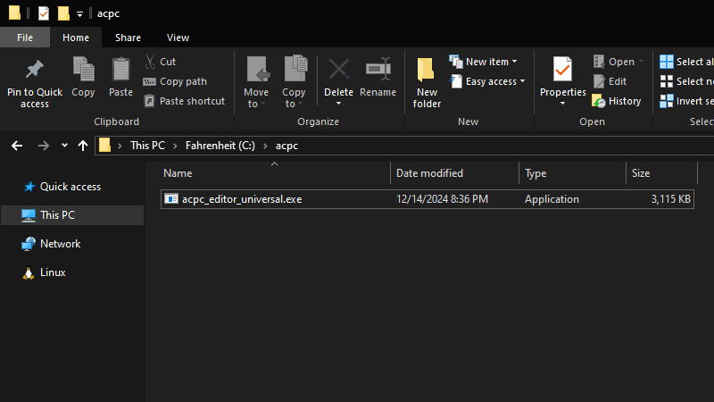

# Pocket Camp Save Editor

A Pocket Camp save editor made by [Thulinma](https://github.com/Thulinma). 
To use, [download the app](../assets/acpc_editor_universal.exe), and then open its location within file explorer. Click where the directory is then type `cmd`.

   

## Usage

You can run the app by typing `acpc_editor_universal.exe`. Run the app without any parameters to print a help message of what is possible.

Example commands:
- To change leaf tokens: `acpc_editor_universal.exe oldsave.bin newsave.bin --tokens=XXYYZZ`
- To change gold treats: `acpc_editor_universal.exe oldsave.bin newsave.bin --goldtreats=XXYYZZ`
- You can prefix the number with + or - to add or remove amounts (`--bells=+50`)

Please keep the following in mind:
- The app currently has no graphical interface. You must use the cmd in order to use it (a web interface is being worked on though)
- The app currently has limited editing, which is restricted to:
  - Editing Leaf Tokens
  - Editing Bells
  - Editing Ok Motors game medals
  - Editing Complete Tickets
  - Editing Gold treats
- While data loss isn't expected, **take backups of your save before using this**.

# Source code
If you want to look at the source code, you can [download it here.](../assets/acpc_editor_source.zip)