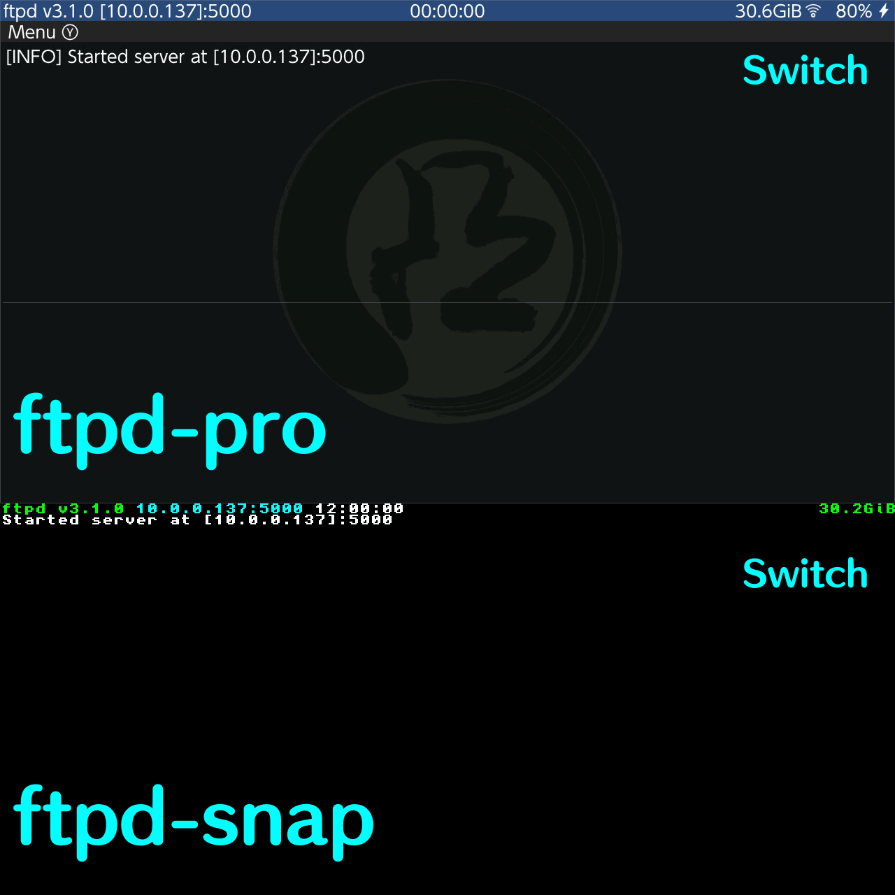
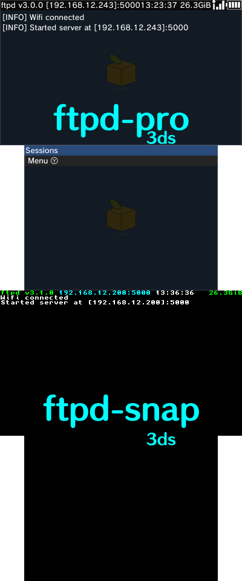
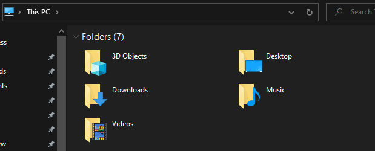

**FTPD**, being developed by [mtheall](https://github.com/mtheall), is an app that allows you to transfer files to your Switch/3ds via Wi-Fi, meaning that you won't have to remove your SD card or turn off your switch everytime you need to put something on there.

FTPD requires a local Wi-Fi connection, so both your Switch/3ds and your PC need to be connected to the same internet.

<big>**Table of Contents**</big>

- [Prerequisites](#prerequisites)
- [Downloading](#downloading)
- [Installing](#installing)
  - [Switch](#switch)
  - [3ds](#3ds)
- [Using](#using)
- [Troubleshooting](#troubleshooting)

# Prerequisites

- A Switch/3ds with custom firmware
- A Wi-Fi connection
- FTPD (duh)

------

# Downloading

There are 2 versions of **FTPD**, these versions being `ftpd-snap` and `ftpd-pro`. There is no difference between them, other than the GUI. `ftpd-pro` uses DearImGui, making it prettier than `ftpd-snap`. It's all up to you as to which you want.

[Download the latest version of `ftpd-classic` or `ftpd`](https://github.com/mtheall/ftpd/releases). The **classic** is ftpd-snap. Download the **3dsx** or **CIA** if you're on 3ds. Download the **nro** if you're on Switch. At the time of writing this, the latest version is v3.1.0.

# Installing

## Switch

All `nro` files go in the **switch** folder on [root](../assets/images/misc/root.png). Then to open it, you can open the homebrew launcher and select FTPD. If you do not have the folder (for whatever reason) create it.

## 3ds

If you're on 3ds, you should already know where to put the file. However, incase you forgot, here's a recap. All `3dsx` files go in your **3ds** folder on [root](../assets/images/misc/root.png). If you do not have the folder, create it. Then to open it, you open the homebrew launcher and select FTPD. 

If you want it to show on the home screen however, you can instead install the **CIA** through FBI. To do this, put the `ftpd-(classic).cia` in the **cia** or **cias** folder on root. If you do not have the folder, create it. After putting the file in there, open FBI, navigate to "cias". Select `<current directory>`, select the “**Install and delete all CIAs**” option, then press (A) to confirm. On the home screen, you'll see ftpd or ftpd snap, depending on which you chose. If you do not, try restarting your device or reinstalling the CIA.

# Using

The use process would be the same for both 3ds and Switch. You'll see your IP address for the device at the top, along with the port. The connection process should be the same if your file manager has a search bar, or if you're using an FTP client like Filezilla. Type in `ftp://<ip-address>:5000`. In my case, on Switch, this would be `ftp://10.0.0.137:5000`. It will then show me my Switch's files, and I can copy files to/from with no problem. When performing any actions, you will see a log of them on FTPD. You can scroll through this log to see the actions you have committed, but I am not sure if you can save these logs.

When copying files, do **NOT** drag and drop folders or files. Instead, copy them with **CTRL + C**, and paste them with **CTRL + V**. Dragging and dropping can lead to deletion of the file/folder itself. If you believe the transfer process has completed, but it is not showing in your application, refresh by clicking the Refresh button, or pressing `f5`. 

  

# Troubleshooting

Not connecting? Double check that you've entered in your IP address correctly, along with `ftp://` before it, and `:5000` after it. Your PC and Switch/3ds need to be connected to the same network, so make sure that they are. Please also make sure that you have actually opened FTPD on your 3ds/Switch, as if they aren't, it will not be open for FTP requests.

If this annoys you, you can instead use [sys-ftpd-light](https://github.com/cathery/sys-ftpd-light), which instead runs in the background. It might have problems with sys-botbase though, so if you have any issues with it after installing, remove it.