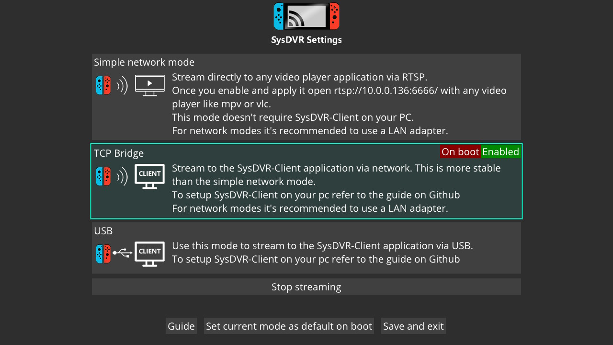
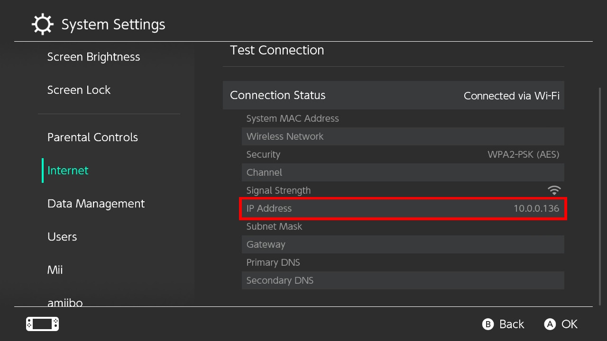

Last updated: June 25, 2021. If anything's changed, sorry! LMK on Discord.

It should also be noted that most of the information here was *obviously* taken from the [wiki](https://github.com/exelix11/SysDVR/wiki/), but to make things easier to understand.

Streaming your Switch to your computer is possible without needing any additional hardware, like a capture card. This is possible with a cross platform (PC, Mac, Linux) homebrew app called SysDVR, being developed by [exelix11](https://github.com/exelix11) The only thing you need is Custom Firmware, your common sense and your parents permission!

It is important to note that only games supporting video capture will work with SysDVR, so if you planned to stream a game that doesn't support it, you're out of luck and need to buy a capture card. [You can read this page to see if the game you're trying to stream is compatible.](../pages/gamesw-video-capture.md)

<big>**Table of Contents**</big>

- [Prerequisites](#prerequisites)
- [Installing](#installing)
- [Setup](#setup)
  - [Windows Setup](#windows-setup)
  - [Linux Setup](#linux-setup)
  - [CrapOS Setup](#crapos-setup)
- [Streaming](#streaming)
  - [TCP Bridge](#tcp-bridge)
  - [USB Streaming](#usb-streaming)
- [Using SysDVR with OBS](#using-sysdvr-with-obs)
- [Troubleshooting](#troubleshooting)

# Prerequisites

- As said before, a Nintendo Switch with custom firmware.
- SysDVR (duh)
- This is optional, but you can use a USB Type-C cable to stream via USB. It's easier to just connect to the internet.
- The latest version of Atmosphere (other CFW's only work in theory, and neither I nor exelix will be able to provide support if you use something else)

------

# Installing

[Download the latest version of `SysDVR-Client.7z` and `SysDVR.zip`](https://github.com/exelix11/SysDVR/releases/). <big>**Unless you have very specific reasons you should use the full version, regardless of if you're only going to stream via USB.**</big> At the time of writing this, the latest version is v5.1, and thus that is the version that this page will be going over. However the process should be the same for any future versions. You're also going to need something like [`7-zip`](https://www.7-zip.org/) to actually extract the contents of them.

Extract the contents of `SysDVR.zip` to your SD card. **You should NOT have a folder/file called SysDVR on root.** Your directory should look like this, and if it does that's how you know you have it installed correctly. If your switch is already running when you put these files on the SD, then you'll have to restart your switch for the changes to take effect.

<pre>├── atmosphere
│   └── contents
│       └── 00FF0000A53BB665
│           ├── <b>exefs.nsp</b>
│           ├── flags
│           │   └── <b>boot2.flag</b>
│           └── <b>toolbox.json</b>
├── config
│   └── sysdvr
│       └── <b>rtsp</b>
├── switch
│   └── <b>SysDVR-conf.nro</b>
</pre>

Now that you have SysDVR on your Switch, boot into CFW, open the Homebrew launcher, then open the SysDVR Settings app. By default, SysDVR will stream with Simple network mode. To switch, select either TCP bridge or USB, then select `Set current mode as default on boot`, so you don't have to open this app again every time you want to stream. Now select `Save and exit` to apply your changes. At this point, you're done with the switch, and can now move onto your computer.

  

# Setup

Depending on what platform you're using, there will be different ways to setup SysDVR on your computer. 

- `SysDVR-Client.exe` is the actual client. It's a CLI, and only needs to be used if you're on Mac or Linux.
- `SysDVR-ClientGUI.exe` is a graphical interface for SysDVR-Client.exe, to make things easier for people. It's Windows only, so anyone on Mac/Linux have to use the CLI (which, if you're using Linux, you're probably used too anyway)

## Windows Setup

---

1. First, you need to download and install [**.NET 5**](https://dotnet.microsoft.com/download). **You must download the x64 version.**
   - The **.NET Framework** and **.NET core 3** are not the same thing. You still need [**.NET 5**](https://dotnet.microsoft.com/download)
   - This isn't always needed, but you might have to also install the latest [MSVC libs](https://support.microsoft.com/en-us/help/2977003/the-latest-supported-visual-c-downloads).
2. Now that it's installed, you should be all hooked up! Launch SysDVR-Client.exe from the terminal or open SysDVR-ClientGUI.exe.

## Linux Setup

---

These commands are for the default Ubuntu package manager. If you've got a different distro then you have to look for equivalent commands yourself.

1. First, you need to download and install [**.NET 5**](https://docs.microsoft.com/en-us/dotnet/core/install/linux).
   - Like said with windows, you NEED [**.NET 5**](https://docs.microsoft.com/en-us/dotnet/core/install/linux). Nothing else will work.
2. Open the terminal, and install both **ffmpeg** and **SDL2** with these commands
<pre>
sudo apt install ffmpeg
sudo apt install libsdl2-dev
</pre>
3. Now that those are installed, you should be all hooked up!

## CrapOS Setup

---

These commands use brew. If you use a different package manager then you have to look for equivalent commands yourself.

1. First, you need to download and install [**.NET 5**](https://dotnet.microsoft.com/download?initial-os=macos)
   - Like said with Windows, you NEED [**.NET 5**](https://dotnet.microsoft.com/download?initial-os=macos). Nothing else will work.
2. Open the terminal, and install both **ffmpeg** and **SDL2**
<pre>
brew install ffmpeg
brew install SDL2
</pre>
3. Now that those are installed, you should be all hooked up!

# Streaming

Now we get to the actual fun part! There are 3 different modes for streaming, those modes being RTSP, TCP bridge, and USB. If you have a good cable, then streaming with USB will give you the best quality. For wireless, TCP bridge is the best. Although RTSP mode us *decent*, it's basically the worst out of all three, which is why I won't be going over using it. If you want to stream via RTSP anyway, you can check out the [page on the wiki for it.](https://github.com/exelix11/SysDVR/wiki/Network-RTSP-mode-(default-mode))

## TCP Bridge

---

<big>Using the GUI</big>

Using this mode is very simple. Make sure that you've selected TCP bridge from within the SysDVR app on your Switch. Grab your Switch's IP address, which can be found in your *Internet Settings*, type that into SysDVR, select `TCP Bridge (network mode)`, and then launch. A player will open up, and you can now watch your Switch on your computer!

Below is a picture of where to look for your Switch's IP address.

  

<video controls autoplay loop muted playsinline width="100%">
  <source src="assets/video/misc/SysDVR-TCP.mp4" type="video/mp4">
  <source src="assets/video/misc/SysDVR-TCP.webm" type="video/webm">
</video>

<big>Using the Terminal</big>

Make sure you've selected `TCP Bridge` from within the SysDVR app on your Switch, CD into your SysDVR directory, and launch it like this: `dotnet SysDVR-Client.dll bridge <ip address>`, obviously replacing `<ip address>` with your Switch's IP.

When using the terminal, you can add the flags `--no-audio` and `--no-video` to disable either audio or video.

## USB Streaming

Streaming via USB is a little bit harder, as it requires installing custom USB drivers for the Switch.

<big>Setting up the driver on Windows</big>

Plug your Switch into your computer, then [download and launch Zadig.](https://zadig.akeo.ie/) If you haven't installed a driver for SysDVR before you should see 2 of them, those two being `SysDVR - Video (Interface 0)` and `SysDVR - Audio (Interface 1)`. Install the `WinUSB` driver for both of them. If you have indeed downloaded a driver before, you might only see a single `SysDVR (Nintendo Switch)` device. Replace that driver by installing the WinUSB.

**If you see only `Nintendo Switch`, then SysDVR is not running**. Make sure that you have it installed correctly, and that you're booted into Custom Firmware. This will not work in stock.

**Before installing the drivers, make sure that the USB ID is `057e 3006`.** If it's different, then SysDVR's sys-module might not be working. Try waiting a bit longer for it to register (about 20 seconds after restarting your Switch). If waiting doesn't fix it, try reinstalling SysDVR.

<big>Setting up the driver on Linux and CrapOS</big>

This is easier on Linux and Mac! You probably already have the required libray installed. If not, this is how you install it.

As said before, this goes over installing it for Ubuntu. If you use other distros, you're smart enough to figure out the command for your own package manager 🥴

Linux:
<pre>
sudo apt install libusb-1.0-0
</pre>

MadOS:
<pre>
brew install libusb
</pre>

On some installations, `libusb-1.0` might go by a different name. You can make a symlink to the correct one, which is shown on [the LibUsbDotNet repo](https://github.com/LibUsbDotNet/LibUsbDotNet#linux-users)

<big>Using the GUI</big>

Make sure that you've selected USB from within the SysDVR Settings on your Switch, and that you've [installed the correct USB drivers.](#usb-streaming) Now select `USB (requires setting up USB drivers)` on the client and click launch. A player will open up, and you can now watch your Switch on your computer!

<video controls autoplay loop muted playsinline width="100%">
  <source src="assets/video/misc/SysDVR-USB.mp4" type="video/mp4">
  <source src="assets/video/misc/SysDVR-USB.webm" type="video/webm">
</video>

<big>Using the Terminal</big>

Make sure you've selected `USB` from within the SysDVR app on your Switch, CD into your SysDVR directory, and launch it like this: `dotnet SysDVR-Client.dll usb`

When using the terminal, you can add the flags `--no-audio` and `--no-video` to disable either audio or video.

# Using SysDVR with OBS

On occassion, people will ask on discord how they can show SysDVR in OBS to stream it. Now when I'm in a bad mood I simply link them an "OBS for dummies" video since capturing windows is one of the first things that's explained in all of them, but I might as well explain here to get them to shut their traps.

Add a new source, this source being a Window capture. Select SysDVR-Client as the window, and uncheck Capture Cursor. 

<video controls autoplay loop muted playsinline width="100%">
  <source src="assets/video/misc/SysDVR-OBS.mp4" type="video/mp4">
  <source src="assets/video/misc/SysDVR-OBS.webm" type="video/webm">
</video>

# Troubleshooting

Maybe you've gotten an error while using SysDVR, but don't know how to fix it. That's what the troubleshooting is for! You can join either [exelix's discord](https://discord.gg/rqU5Tf8) server or my [own discord server](https://discord.com/invite/bHmqQuU) to ask for help.

<big>[You should take a quick read through the troubleshooting page on the wiki though before you ask any questions](https://github.com/exelix11/SysDVR/wiki/Troubleshooting)</big>, as they might've already been answered there.
