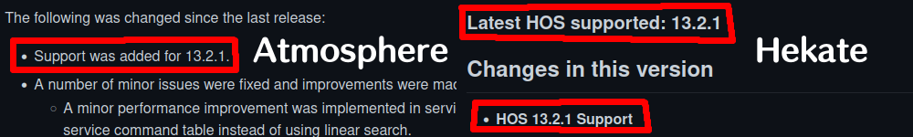
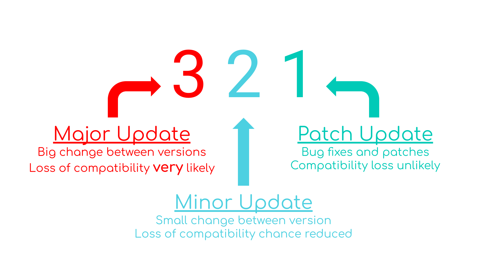
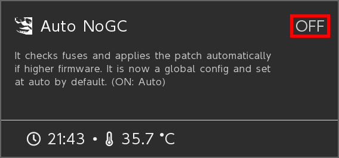
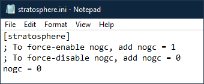

---
**Be aware that, no matter what, EVERY time you modify the console, there's a chance of an UNRECOVERABLE BRICK.** These are very, *very* rare, but still a possibility, so always make sure that you follow any directions EXACTLY.  

---

## Finding your serial number

Serial Numbers are important, as not every Switch can be modded. With the serial number, you can check if your switch is patched or not. `Unpatched` / v1 switches are any switches that were made before early June of 2018. Any switch made after that is what's called a `Patched` / v2 switch. The difference from the two, is that the original Switch (v1) was made with a Tegra x1 chip. These chips, when they're in Recovery Mode (RCM), are able to execute unverified code. This one exploit allows people to develop payloads for the switch, which can then be injected. NVIDIA *has* [publicly responded to the RCM exploit](https://nvidia.custhelp.com/app/answers/detail/a_id/4660/~/security-notice%3A-nvidia-tegra-rcm-vulnerability). And before you ask, you can't mod a Patched switch. You can *technically*, with a mod chip, but those would be illegal to use since modifying the hardware is against Nintendo's TOS, but also they're hard to find since the company that was making them (Team Xecuter) got shut down.

To find your serial number, enter the `System Settings` on the switch, scroll down to `System`, then click on `Serial Information`.
{: .shadow .rounded-10}
_Serial Info Settings_

Once you click it, it will show your Serial Number at the top of the screen. I have censored my Serial Number here, as you shouldn't give out your entire Serial. Only the 4 numbers after XXX should you give out, if you're asking for assistance.
{: .shadow .rounded-10}
_Serial Info_

As you saw earlier, my Switch is a XAW1, and between 1000 and 1007, so I have an <span style="color:green">Unpatched</span> unit. If you have a <span style="color:orange">Potentially patched</span> unit, then in reality there's only a 30% chance that you can actually mod it. You're better off selling your current Switch then buying an <span style="color:green">Unpatched</span> unit.

| Serial     | <span style="color:green">Unpatched!!</span> | <span style="color:orange">Potentially patched??</span> | <span style="color:red">Patched.</span> |
|-----------:|----------------------------------------------|---------------------------------------------------------|-----------------------------------------|
| XAW1       | 10000000000 to 10074000000                   | 10075000000 to 10120000000                              | Anything above 10120000000              |
| XAW4       | 40000000000 to 40011000000                   | 40011000000 to 40012000000                              | Anything above 40012000000              |
| XAW7       | 70000000000 to 70017500000                   | 70017500000 to 70030000000                              | Anything above 70030000000              |
| XAJ1       | 10000000000 to 10020000000                   | 10020000000 to 10030000000                              | Anything above 10030000000              |
| XAJ4       | 40000000000 to 40046000000                   | 40046000000 to 40083000000                              | Anything above 40083000000              |
| XAJ7       | 70000000000 to 70040000000                   | 70040000000 to 70050000000                              | Anything above 70050000000              |
| XAW9       |                                              | All potentially patched.                                |                                         |
| XAK        |                                              | No info, only sold in Korea.                            |                                         |
| XKW or XKJ |                                              |                                                         | Mariko switches, all patched.           |

<sup>taken from [here](https://gbatemp.net/threads/switch-informations-by-serial-number-read-the-first-post-before-asking-questions.481215/)</sup>

## Preparation

Before you start modding, you should check 4 things off your list:

1. Have at least one eShop game, demo, app, or cartridge
2. Have a Jig
3. Have a PC and a USB C cable for data transfer
   - Or, have an Android device and a USB C cable for data transfer
   - Or, have a Lightning to OTG adapter, a jailbroken iOS device and a USB C cable for data transfer
4. A 64 gigabyte (or higher) microSD card
   - 32 gigabytes of space is needed to backup your system files. If one file's slightly bigger, you'll have to remove the SD to copy the last file (which is a hassle)
   - 32 gigabytes is required for an emuMMC partition. This guide [doesn't go over setting up an emuMMC](../pages/ban-risks#why-shouldnt-i-use-emunand), but keep it in mind if you change your mind.

(1) You need an app to enter Title Takeover, which allows homebrew to run with full system resources.<br>(2) A jig is required to enter RCM. You can buy a good jig on [Amazon here](https://www.amazon.com/gp/product/B07J9JJRRG).<br>(3) The only injection process on the guide at the moment is TegraRCM using a PC. I might show how to inject on other platforms in the future, but for now that's it. Go [here for Android](https://github.com/MenosGrante/Rekado), go [here for iOS devices](https://mologie.github.io/nxboot/). 

### Preparing the SD

#### Formatting the SD

Your SD card *should* be formatted to FAT32. Using exFAT on the Switch should be avoided, since the exFAT drivers on the switch are literal dogwater and are prone to corruption. It can also prevent certain homebrew/cfw from booting, which is another reason why it shouldn't be used.

#### **Formatting on Windows**

For formatting on Windows, this guide uses GUIFormat. GUIFormat is used because it allows you to format drives that are higher than 32gb, where using the default format tool doesn't allow you to go any higher.

You can download from the official website, or you can download it from this repository, if the official one is down.

[Official Download](http://ridgecrop.co.uk/index.htm?guiformat.htm)

[Backup](../assets/guiformat.7z)

Once you have it downloaded, open the .exe. It'll ask for administrative purposes, which you need to give. After that, change the drive to your SD's drive (**it will NOT be C:.**) It'll most likely be D, E, H, I, or something similar. 

*Note: **BE ON THE RIGHT DRIVE.** Formatting your drive deletes all your data, and last time I checked you had some important things in your homework folder!*

With that being said, now would be a great time to backup your data (if you have any data on it). If you've used your SD on your switch already and have taken some pictures that you just can't afford to lose, back them up! 

Once the drive is selected, keep the allocation unit size on either 32768 or 65536, give your SD a label if you want, then keep `Quick Format` CHECKED. Without getting too deep into it, quick format is... quick. Click start, then watch your SD convert to fat32.

{: .shadow .rounded-10}
_GUIFormat format to fat32_

If you get an error that looks like this, you just need to make sure that your file explorer is closed before pressing start.

{: .shadow .rounded-10}
_GUIFormat file exploror open error_

#### **Formatting on MacOS**

I don't have a Mac, so I can't provide any extra screenshots, however you can [follow the Apple Support page for formatting](https://support.apple.com/guide/disk-utility/format-a-disk-for-windows-computers-dskutl1010/mac).

#### **Formatting on Linux**

This guide uses GParted. GParted works on most Linux distros, so you probably don't have to worry about missing out if you use Hannah Montana Linux.

GParted is included by default in some distros, however if it isn't you can look it up with your systems installed package manager. If you can't find it in your package manager, you can install it from the command line.

| Linux Distro | Package                                                                   | Terminal Command                   |
|-------------:|---------------------------------------------------------------------------|------------------------------------|
|       Debian | [gparted](https://packages.debian.org/search?keywords=gparted)            | ```sudo apt-get install gparted``` |
|       Ubuntu | [gparted](https://packages.ubuntu.com/search?keywords=gparted)            | ```sudo apt-get install gparted``` |
|       Fedora | [gparted](https://koji.fedoraproject.org/koji/packageinfo?packageID=1950) | ```su -c "yum install gparted"```  |
|       Mageia | [gparted](https://madb.mageia.org/package/show/name/gparted)              | ```sudo urpmi gparted```           |
|     OpenSUSE | [gparted](https://software.opensuse.org/package/gparted)                  | ```sudo zypper install gparted```  |

If your distro isn't listed here, you can either try to find it in it's package manager or simply [check out the official download instructions](https://gparted.org/download.php).

Now that you have GParted installed, open it. Find your SD Card in the top right drop down box (will most likely be something like /dev/sdb or /dev/sdc). In my case, it was /dev/sdc.

*Note: **BE ON THE RIGHT DRIVE.** Formatting your drive deletes all your data, and last time I checked you had some important things in your homework folder!*

With that being said, now would be a great time to backup your data (if you have any data on it). If you've used your SD on your switch already and have taken some pictures that you just can't afford to lose, back them up! 

Assuming you're on the right drive, right click the partition, Select `Format to` and then `fat32`. After you've done that, click the green checkmark at the top of the window to apply the changes.

If you need visuals, below is a video.

<video controls autoplay loop muted playsinline width="100%">
  <source src="../assets/video/linux/GPartedK.mp4" type="video/mp4">
  <source src="../assets/video/linux/GPartedK.webm" type="video/webm">
</video>

### Required Files

We're now going to place the required files for CFW, with some added homebrew files. Yeah, we could just use Atmosphere's own bootloader (called fusée), however we'll be using Hekate instead, just so we can backup the systems NAND, and use some features that'll be helpful in the future.

A [hekate_ipl.ini](../assets/hekate_ipl.ini) config file (open the link, right click > save page as)  
The bootlogos folder [bootlogos.zip](../assets/bootlogos.zip)  
The latest release of [Atmosphere](https://github.com/Atmosphere-NX/Atmosphere/releases) (get the `atmosphere-(version)-master-(version)+hbl-(version)+hbmenu-(version).zip`, and not `atmosphere-EXPERIMENTAL-(version)-master-(version)+hbl-(version)+hbmenu-(version).zip`)  
The latest release of [FTPD](https://github.com/mtheall/ftpd/releases) (download `ftpd.nro`)  
The latest release of [Hekate](https://github.com/CTCaer/Hekate/releases/) (download `hekate_ctcaer_(version).zip`)  
The latest release of [JKSV](https://github.com/J-D-K/JKSV/releases) (download `JKSV.nro`)  
The latest release of [Lockpick_RCM](https://github.com/shchmue/Lockpick_RCM/releases) (download `Lockpick_RCM.bin`)  
The latest release of [nxdumptool](https://github.com/DarkMatterCore/nxdumptool/releases) (download `nxdumptool.nro`)  
The latest release of the [hbappstore](https://github.com/fortheusers/hb-appstore/releases) (download `appstore.nro`)  

<big><big>**After downloading, follow these instructions:**</big></big>

1. Copy *the contents* of the Atmosphere`.zip` to the root of your SD
2. Copy the `bootloader` folder from the Hekate`.zip` to the root of your SD
3. Copy the `bootloader` folder from the `bootlogos.zip` to the root of your SD (if you're asked to merge the folders, do so)
4. Copy `hekate_ipl.ini` inside the `bootloader` folder on your SD
5. Copy `Lockpick_RCM.bin` to the `/bootloader/payloads` folder on your SD
6. Create a folder named `appstore` inside the `switch` folder, and copy `appstore.nro` to it.
7. Copy `ftpd.nro`, `JKSV.nro`, and `nxdumptool.nro` inside the `switch` folder on your SD.

If you were using your SD before and backed up your Nintendo folder, now would be the time to put it back on.

Your SD cards contents should look something like this. The Nintendo folder will be here if you've already used your SD with your switch.

{: .shadow .rounded-10}
_SD Contents_

## Injection Apps

To inject payloads on Windows, you use something called [TegraRCMGui](https://github.com/eliboa/TegraRcmGUI/releases). Download either the MSI or zip.

If you want to inject a payload on other platforms:

[Fusée Launcher](https://github.com/Qyriad/fusee-launcher) (Linux)  
[NXBoot](https://mologie.github.io/nxboot/) (OS X, iOS)  
[Rekado](https://github.com/MenosGrante/Rekado) (Android)  
[Web Fusée Launcher](https://fusee-gelee.firebaseapp.com/) (cross platform! works in a browser, only in chrome)  

### TegraRCM

1. Run the TegraRCMGUI installer, and after installation, start the program. Or just run it if you downloaded portable.
2. In the `Settings` tab, click on `Install Driver`, which will install the drivers needed for Tegra to detect your Switch.
3. After the drivers have been installed, plug your Switch into your computer. While it's still plugged in, power off your switch COMPLETELY (so hold down the power for 5 seconds, select Power Options, then turn off)
4. *Insert* your Jig into the right joy-con slot, making sure the pins aren't visible, and then press the Power button and VOL+ at the same time. Your Switch screen should stay black; if it turns on normally, retry from step 2.
5. If you see RCM O.K in the bottom left of Tegra, then you know your switch is in RCM. This is where you can actually inject a payload!!

{: .shadow .rounded-10 .right}

Once your switch is in RCM, you can inject payloads. We'll be injecting Hekate.

In the `hekate_ctcaer_(version).zip` that you downloaded, inside was the `hekate_ctcaer_(version).bin`. That file is what you'll be injecting. Move it to any accessible place on your PC.

In the `Payload` tab of Tegra, click on the folder icon and navigate to the `hekate_ctcaer_(version).bin` file. Select it, and then click on `Inject Payload` and your switch will boot into the hekate menu.

## Backing Up System Files (optional, but recommended)

Now that you're in Hekate (congrats btw!!) you **should** backup your Switch's NAND. This is entirely optional, however VERY recommended, to ensure you have a backup of your switch incase (somehow, someway) you brick it. It's also useful if you want to basically erase all evidence that you had modded your switch in the first place. Of course, this does not remove a ban from your switch if you're banned, but if you just wanted to mod your switch to see what it'd be like, then you can restore your backup to delete that incriminating evidence.

As they say, the best backup is the one you have but never need, and the worst backup is the one you need but never made. 

### Switch NAND

You ARE going to need at**least** 32gb of free space to dump your Switch NAND (unless you want to dump it 4gb at a time).

1. On Hekate, tap on the `Tools` tab and select `Backup EMMC`.
2. Once here, tap on `eMMC BOOT0 & BOOT1`. It'll take a couple seconds, but once it's done it should say `Finished and verified!`. Under `Filepath:` is where you'll see the location of the dump.
3. Close this screen then select `eMMC RAW GPP`. It should take some time, since the Switch's rawnand.bin is quite large. (it'll take even longer if you're dumping it 4gb at a time). This can take anywhere from 15minutes up to an hour and a half, all depends on the speed of your SD card.
4. Tap on Close twice to return to the tools menu, and copy the `backup` folder to your computer (or someplace safe). Once you got your `backup` folder copied someplace else, you can delete the `backup` folder on your SD. To save a bit of space, you can compress the backup folder in a .zip, .7z, or something similar. 

I'd recommend that whenever a major update comes out for the Switch, that you also redump your NAND. Creating a backup of 10.0.0 and trying to restore it on 13.2.1 would either fail, or downgrade your switch (which can cause trouble down the line). [Refer here](../assets/images/misc/switch_update_compatability.png) for what's considered a major update.

### Switch keys

Your Switch keys aren't that large, so you don't have to worry about spending another hour backing them up.

1. On the `Home` tab of Hekate, select `Payloads`. Once here, open `Lockpick_RCM.bin`. (if it's not here, you didn't follow [Required Files](#required-files) correctly)
2. Once Lockpick has loaded, press the power button to select `Dump fron SysNAND`. You'll see some pretty colors for a moment!
3. After Lockpick is finished, your `prod.keys` and `title.keys` should be in `sd:/switch`.
4. Now that you have your keys, copy them to your computer (or someplace safe). Once you got your keys backed up somewhere, you can delete the keys on your SD. You wouldn't HAVE to compress these, since (in total) they're only 12kb, but you can still do it if you'd like to.

Now that you've finished those steps, you're basically finished at this point! All you need to do now is actually boot into CFW. You might be asking, am I not already in CFW? Well, no. You've simply injected a payload.

---

## Launching CFW

To launch into CFW, on the Hekate `Home` tab, select `Launch`, then select `CFW (SYSNAND)`. If you get an error like <span style="color:yellow">No main boot entries found...</span>, then you haven't downloaded the hekate_ipl.ini and put it in your bootloader folder. If this is the case, download the [hekate_ipl.ini](../assets/hekate_ipl.ini) config file (open the link, right click > save page as)

But if you don't get that error, then you're in CFW! You ARE gonna have to inject a payload every time you want to enter CFW though, so remember that as soon as you turn off your switch you'll be back in normie territory.

## Updating CFW

When a new system update is released, there's 3 things that need updating: Atmosphere, Hekate, and your firmware. 

### **Updating Atmosphere**

1. Turn off your Switch and put the SD card in your computer
2. Download the latest release of Atmosphere (the `atmosphere-(version)-master-(version)+hbl-(version)+hbmenu-(version).zip`)
3. Copy *the contents* of the Atmosphere.zip to your SD card
4. (If Hekate needs updating, follow the next section)
5. Put your SD card in your switch and launch CFW

### **Updating Hekate**

1. Turn off your Switch and put the SD card in your computer
2. Download the latest release of Hekate (the `hekate_ctcaer_(version).zip`)
3. Copy the `bootloader` folder from the Hekate.zip to your SD card. If asked to overwrite or merge files, select yes.
4. Put your SD card in your switch and launch Hekate
5. Go to the Options tab of Hekate in the top right. If it isn't already, enable `Update Reboot 2 Payload`, then `Save Options`.
6. Launch CFW

### **Updating Firmware**

Before updating your firmware, first check that Atmosphere *and* Hekate support the firmware you're updating to. The releases page on both will tell you the latest version that's supported. 

{: .shadow .rounded-10}

#### What constitutes an update?

Surprisingly, not all *firmware* updates require Atmosphere and Hekate to update as well. There are 3 types of updates: Major, Minor, and Patches.<br>Major updates will almost always require Atmosphere and Hekate to update.<br>Minor won't break compatibility as often, but the chance is still there.<br>It is extremely unlikely for patch updates to break compatibility.

It's great to know that you *can* update to a patch or minor update without Atmosphere, but that doesn't mean you should. It might bring errors, and no one likes those. And you don't wanna be the person to find out the minor update prevents booting. So you should wait for official word from CTCaer or SciresM saying it's okay to update the firmware, or if you'll have to wait.

{: .shadow .rounded-10}

## Troubleshooting

### Gamecard can't be read

If you're getting a "game card could not be read" after updating your switch, go into the options tab in Hekate and toggle `Auto NoGC` to off. 

{: .shadow .rounded-10}


If that doesn't work, try this instead: 

1. Open `atmosphere/config/stratosphere.ini` in a text editor, like notepad <br> (if that file doesn't exist, copy it from the template in atmosphere/config_templates/)
2. Force disable NoGC by adding the line `nogc = 0`

Once you've done this, your document should look like the screenshot below. Save it by pressing **CTRL + S**, and reboot into CFW. It should work.

{: .shadow .rounded-10}

---

### Yellow Screen 

Yellow screen errors are most likely the result of your mesosphere being outdated. Completely reinstalling atmosphere should fix the issue.

Make sure that the Atmosphere version you've downloaded is the latest. Now backup the `atmosphere/contents` folder on your SD card somewhere, like your PC. Delete the entire atmosphere folder on your SD card, then drag the latest onto your SD card. Transfer the `atmosphere/contents` back, and it should be fixed.

---

### 2001-0123 Error Code

The 2001-0123 error code is caused by a partial update being applied to Atmosphere, instead of a full one. This means that NCAs from the latest update are installed but BOOT0 still contains an earlier version. Completely reinstalling atmosphere should fix the issue. 

Make sure that the Atmosphere version you've downloaded is the latest. Now backup the `atmosphere/contents` folder on your SD card somewhere, like your PC. Delete the entire atmosphere folder on your SD card, then drag the latest onto your SD card. Transfer the `atmosphere/contents` back, and it should be fixed.

---

## Misc

### Customizing Hekate

Through the use of Hekate's config file, we can change the way it looks. This means making the background a custom picture, custom icons for boot options, and the selection color.


<big><b>Changing Hekate Background</b></big>

1. Find or create your image, then load it in an image editor (Paint.NET, Photoshop, Gimp, etc.)
   - Or, you can [use an online website](https://online-converting.com/image/convert2bmp/)
2. Resize the image to 1280x720 (any larger/smaller will not work)
3. When done, save the image as a 32-bit bmp, and call it background.bmp 
   - If you're using the website, change the color to `32 (True color, RGB)` and download. Rename to background.bmp.
4. Move background.bmp into /bootloader/res/ on your Switch's SD card. 

<big><b>Changing Hekate Icons</b></big>

1. Find or create your image, then load it in an image editor (Paint.NET, Photoshop, Gimp, etc.)
   - Or, you can [use an online website](https://online-converting.com/image/convert2bmp/)
2. Resize the image to 192x192 (any larger/smaller will not work)
3. When done, save the image as a 32-bit bmp. It doesn't matter what you call the icons.
   - If you're using the website, change the color to `32 (True color, RGB)` and download.
4. Move background.bmp into /bootloader/res/ on your Switch's SD card. 

<big><b>Loading Changes</b></big>

If you only edited the background, then it will load by default in Hekate.

But if you want to load icons, you need to edit your `hekate_ipl.ini` in the **bootloader** folder. Open it in a text editor like notepad or VSC.

Under every launch choice you should see `icon=` (if not, add it.). Then, type the name of your icon, for example `icon=bootloader/res/custom_cfw_icon.bmp`

The entire ini should look something like this:

```ini
[config]
updater2p=1
{------ Atmosphere ------}
[CFW (SYSNAND)]
fss0=atmosphere/package3
kip1=atmosphere/kips/*
emummc_force_disable=1
icon=bootloader/res/custom_cfw_icon.bmp
{}
{-------- Stock ---------}
[Stock SYS]
fss0=atmosphere/package3
stock=1
emummc_force_disable=1
icon=bootloader/res/custom_stock_icon.bmp
```

Looking at the example above, you can probably already guess how to change the name of the boot options. Simply change what's in brackets.

```ini
[config]
updater2p=1
{------ Atmosphere ------}
[Custom Boot Option Name!]
fss0=atmosphere/package3
kip1=atmosphere/kips/*
emummc_force_disable=1
icon=bootloader/res/custom_cfw_icon.bmp
```