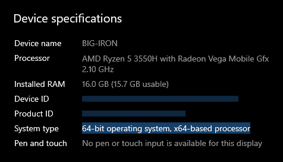
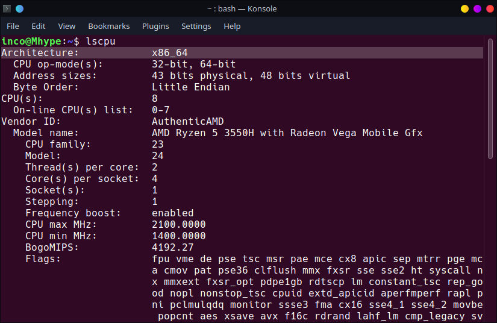
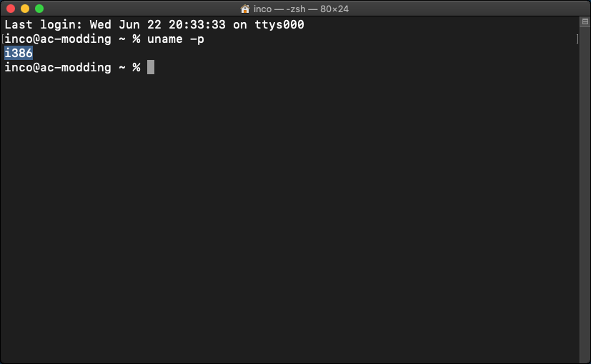
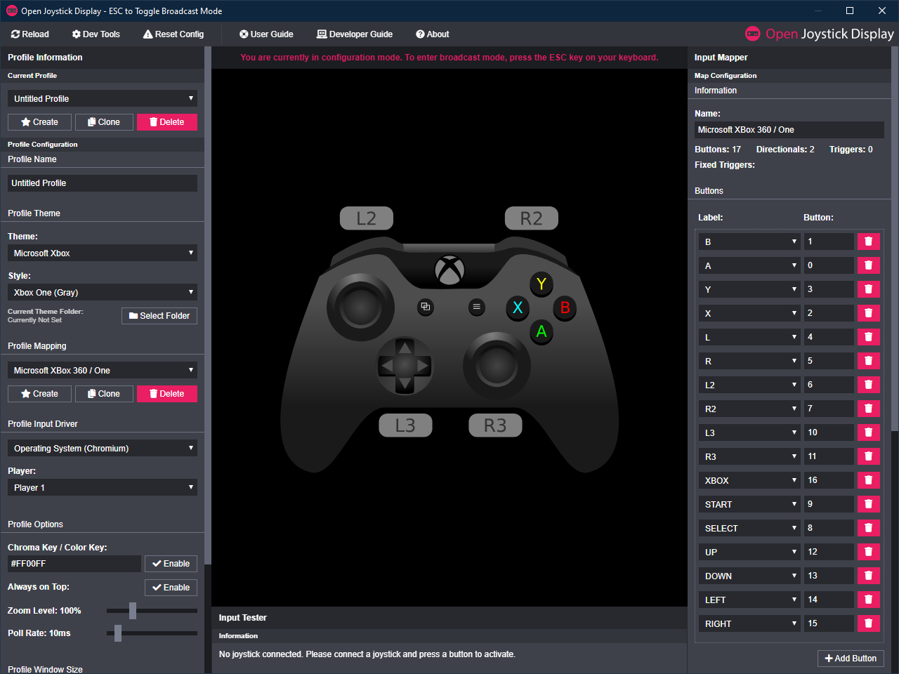
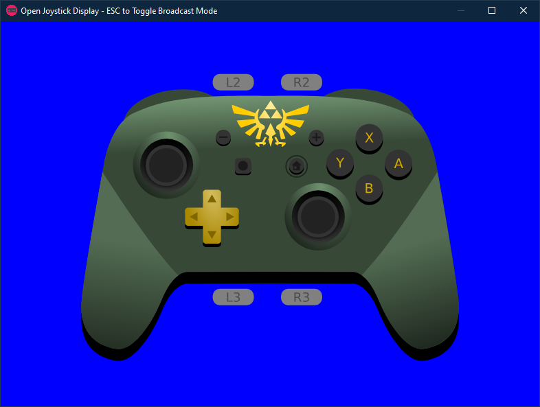

**Open Joystick Display** (OJD), previously being developed by Kernel Zechs, is a cross-platform software used to show inputs of various controllers. **Open Joystick Display Server NX** (OJDS-NX) is a server that allows the Switch to send its inputs to OJD, showing them as an input display.

**Table of Contents**

- [Prerequisites](#prerequisites)
- [Downloading](#downloading)
- [Installing](#installing)
  - [OJDS-NX](#ojds-nx)
  - [OJD](#ojd)
- [Using](#using)
- [QOL For Recording](#qol-for-recording)

# Prerequisites

OJDS-NX can only be used on a modded switch. [Follow my guide if it's not modded already](../switch-guide). There are guides for getting an input display without homebrew, but these require buying third-party adapters and using non-switch controllers, like the PS4 controller. You can find a guide for that [here](https://www.youtube.com/watch?v=dyf-Y_dCP-U), but that's not what this guide is for. 

Open Joystick Display works on x86 and x64 architectures, and you need to know which your computer is to download OJD. You’ll also need your Switch’s IP address further in.

On Windows, open the settings and head to System. Scroll down to About, and you’ll see your architecture under system type.

<p align="center">
  
</p>

On Linux, open the terminal and run `lscpu`. You’ll see the architecture as the first line, x86_64 being 64 bit and i686 as 32 bit. 

<p align="center">
  
</p>

Lscpu comes preinstalled on most distros, however, if you don’t have it, install it using the following commands:

| Linux Distro | Package                                                                 | Terminal Command                      |
|-------------:|-------------------------------------------------------------------------|---------------------------------------|
|       Debian | [util-linux](https://packages.debian.org/search?keywords=util-linux)       | ```sudo apt-get install util-linux``` |
|       Ubuntu | [util-linux](https://packages.ubuntu.com/search?keywords=util-linux)       | ```sudo apt-get install util-linux``` |
|       Fedora | [util-linux](https://koji.fedoraproject.org/koji/packageinfo?packageID=34) | ```su -c "yum install util-linux"```  |
|      Mangeia | [util-linux](https://madb.mageia.org/package/show/name/util-linux)         | ```sudo urpmi util-linux```           |
|     OpenSUSE | [util-linux](https://software.opensuse.org/package/util-linux)             | ```sudo zypper install util-linux```  |

If your distro isn't listed, try finding it in it's package manager.

On Mac, open the terminal and run `uname -p`.

<p align="center">
  
</p>

Now on your Switch, open System Settings and scroll down to the internet tab. Keep your IP address in mind, as you will need it later.

<p align="center">
  
</p>

# Downloading 

[Download OJD here](https://drive.google.com/drive/folders/1FFo8wBBCOSjJ_O-IwFQmDWTy0VWDliwi?usp=sharing). Download the version corresponding to your OS. Download the exe or deb file if you want to install it, but the portable version is the zip or tar.gz. The project’s been discontinued, however, it still works on the latest Atmosphere version. 

To be able to use OJD, we need OJDS-NX, or the display server. [Download that here](https://drive.google.com/file/d/1o5acZsAApDC0z2uQwey2Fa5lP5Z17k2D/view?usp=sharing).

# Installing

## OJDS-NX

Extract the OJDS-NX.zip that you’ve downloaded, and drag the atmosphere folder to your SD card. If it asks you to merge the folders, be sure to do so. And if you used [FTPD](../FTPD) to transfer, make sure to restart your Switch into custom firmware for the sys-module to start running.

## OJD

If you want to install OJD, run the exe on Windows or open the deb file on Debian based distros. If you downloaded the portable version, then run the exe on Windows or execute open joystick display on Linux. 

# Using

When you open the app, you’ll be greeted with this screen. 

<p align="center">
  
</p>

For the input display to work, you have to change 3 things. First, change your theme to Nintendo Switch. Then change the profile mapping to Nintendo Switch (Hacked) OJD Server NX, and set the profile input driver to Network (OJD Server Beta). Right underneath, change the IP address to the one displayed on your switch. Hit reconnect, wait a few seconds, and the input display should be working. If not, try restarting the app. Streaming might stutter if you have a slow computer or bad connection, but otherwise quality should be excellent. Because OJDS-NX only reads the inputs then sends them to your PC, there should be no input lag on your switch.

# QOL For Recording

By default, you’ll have a Black background with a gray pro controller. You might want joy cons instead. Or you want to change the background to be chroma-keyable, as currently with a dark background it will be hard to implement. Luckily, there are built-in ways to do both.

To change your controller, you can select style and change it to whatever you’d like. And then to change the background, change the hex color code to a chroma-keyable color, like green (00FF00) or blue (0000FF), and enable it. Once done, press escape to enter broadcast mode. Now in a recording software, like OBS, add the window and a chroma key filter to it.

<p align="center">
  
</p>