Page for my own sort of *documentation*, and just to test a bit of things. You aren't gonna find anything interesting here (unless you do, and in such case your welcome for the free knowledge)


# me own md doc

Text? It's very special. It can be **bold**, *italic*, ~~strikethrough~~ or even `inline`!

Text can be **bold** by wrapping it in double **asterisks** or __underscores__. 

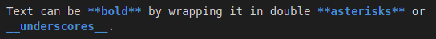

Text can be *italic* by wrapping it in single *asterisks* or _underscores_.

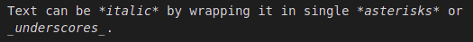

Text can be ~~strikethrough~~ by wrapping it in double tildes.

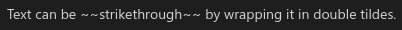

Text can be `inline` by wrapping it in single `backticks`.

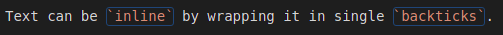

Text can be shown normally, \*without formatting*, by using backslashes.

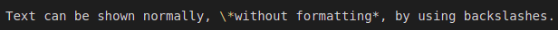

On the topic of text hiding its formatting, any text within inline won't have any formatting! `**Pretty Pog Man!**`

[Linking to another page is easy!](https://www.youtube.com/c/inconsistent_dg/)

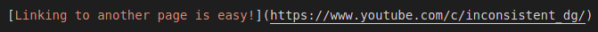

There should be whitespace between paragraphs.

There should be whitespace between paragraphs. Otherwise, text would end up on the same line!
Like in this example!

# Header 1

This is a very normal paragraph header. Inconsistent_dg is one of the nicest guys you'll meet on the internet! [I heard he makes great YouTube videos too!](https://www.youtube.com/watch?v=i6CVfUjJchE)

Headers start off with a hashtag `#`, adding more hashtags means "less-important" headers, ones that will just be smaller than the others.

This is Header 1, the largest (and most important!) a header can get. The lowest one can be is a level 6 header.

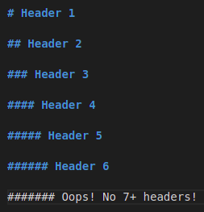

## Header 2

Blockquotes are pretty Poggers! They are used by adding a greater than sign before your text.

> Look Mom look! I'm a blockquote!
>
> You're looking different... new haircut? Either way you're still cute <3

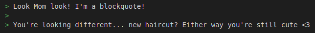

### Header 3

While we're here, might as well talk about code blocks! You make them by wrapping all of your text within three backticks ```.

```
Animal Crossing™: New Horizons for Nintendo Switch and Nintendo Switch Lite handheld consoles, owned by and licenced by Nintendo©
```

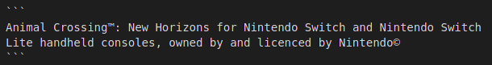

That's just text, but these indeed can be used for code! If you're interested in sprucing the code up a bit, you can specify a language for **syntax highlighting**! Simply type the name of the language after the first trio of backticks.

```js
// I'm JavaScript code! Poggers!
var fun = function lang(l) {
  dateformat.i18n = require('./lang/' + l)
  return true;
}
```
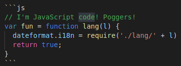

```ruby
# I'm Ruby code! Poggers!
GitHubPages::Dependencies.gems.each do |gem, version|
  s.add_dependency(gem, "= #{version}")
end
```
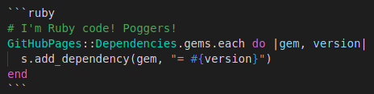

#### Header 4

*   This is an unordered list following a header.
*   This is an unordered list following a header.
*   This is an unordered list following a header.

##### Header 5

1.  This is an ordered list following a header.
2.  This is an ordered list following a header.
3.  This is an ordered list following a header.

###### Header 6

I am totally fine.

Below is a <span data-audio-url="../../assets/misc/TABLE.mp3">table.</span>

<script>
$("[data-audio-url]").each(
    function(){
        $(this).on('click', function() {
            var mp3Url = $(this).attr('data-audio-url');
            var a = new Audio(mp3Url);
            a.play();
        });
    }
);
</script>

| **SUBSCRIBE**               | **TO**                                 | **twitch.tv/inconsistent_dg** |
|:----------------------------|:---------------------------------------|:------------------------------|
| One in 3 people are lazy... |                                        | Neither am I...               |
| I'm not lazy.               |                                        | That only leaves...           |
|                             |  |                               |

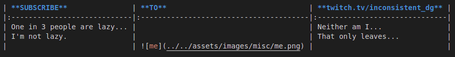

### Ever heard of a thematic break?

There's multiple ways to show them. A sequence of 3 asterisks `*`, underscores `_`, or hyphens `-` can result in this!

***
---
___

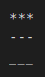

### Here's a list:

Normal lists can start off with either an asterisk `*` or a hyphen `-`.

* Yo
* Waddup
* Gamer
* Girl :)
  * You smell
    * Poggers!!

- What's
- The
- Difference?

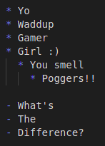

### But now an ordered list!:

Ordered lists have to start with numbers. ANY numbers! Whether or not they start off with what's considered "the first number". It will just go from the starting number. So if instead of 1 you wanted to start the list off with 6, go ahead!

6.  Yo
4.  Waddup
9.  Gamer
    1. boy?
10. Girl! :)
    1.  Yes indeed these can be multi level!
    2.  Hi mom!

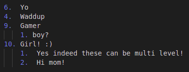

### Images!

Images are basically just like links, except they'll have ! before them. You'll see!

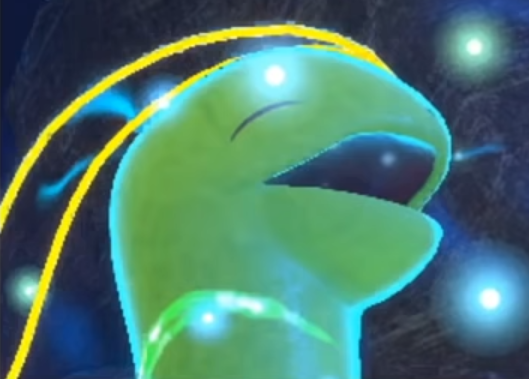

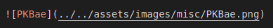

### Best of all: HTML!

HTML works just fine in Markdown, allowing people to still do more advanced techniques that aren't taught in school.

```
Wanna know something cool? Long, single lined paragraphs in a code block actually won't wrap around! Instead, there will be a scroll bar. At some point, this text right here will be long enough to prove that! And if not, oh well! Sorry for disappointing you again Mom!
```
# Header 1

## Header 2

### Header 3

#### Header 4

##### Header 5

###### Header 6

####### Oops! No 7+ headers!

They told me marquee was deprecated... But I don't believe the government!

<marquee>see? this is why you can't trust anyone, not even yourself.</marquee>

Tarou<br>In<br>ACNH

---

Tarou

In

ACNH

Heading level 1
===============

Heading level 2
---------------

<pre>├── 219.md
├── 404.md
├── acm.ico
├── <font color="#3465A4"><b>ACNH</b></font>
│   ├── emulation.md
│   ├── <font color="#3465A4"><b>mods</b></font>
│   │   ├── dialog_editing.md
│   │   ├── editing_textures.md
│   │   ├── model_swapping.md
│   │   └── music_mods.md
│   ├── mods.md
│   ├── MS.md
│   ├── NHSE.md
│   └── Poker.md
├── ACNH.md
├── <font color="#3465A4"><b>assets</b></font>
│   ├── <font color="#CC0000"><b>bootlogos.zip</b></font>
│   ├── colors.xml
│   ├── <font color="#3465A4"><b>css</b></font>
│   │   └── style.scss
│   ├── hekate_ipl.ini
│   ├── <font color="#3465A4"><b>images</b></font>
│   │   ├── <font color="#75507B"><b>acm.png</b></font>
│   │   ├── <font color="#75507B"><b>bkg.png</b></font>
│   │   ├── <font color="#75507B"><b>blacktocat.png</b></font>
│   │   ├── <font color="#75507B"><b>bullet.png</b></font>
│   │   ├── <font color="#3465A4"><b>contact</b></font>
│   │   │   ├── <font color="#75507B"><b>inconsistent-2152.png</b></font>
│   │   │   └── <font color="#75507B"><b>inco.png</b></font>
│   │   ├── <font color="#3465A4"><b>hbrew</b></font>
│   │   │   ├── <font color="#75507B"><b>ams.png</b></font>
│   │   │   ├── <font color="#75507B"><b>ftpd-pro!ftpd-snap!3ds_Comparison.png</b></font>
│   │   │   ├── <font color="#75507B"><b>ftpd-pro!ftpd-snap!Switch_Comparison.png</b></font>
│   │   │   ├── <font color="#75507B"><b>GUIFormatERROR.png</b></font>
│   │   │   ├── <font color="#75507B"><b>GUIFormat.gif</b></font>
│   │   │   ├── <font color="#75507B"><b>hek.png</b></font>
│   │   │   ├── <font color="#75507B"><b>hos_support.png</b></font>
│   │   │   ├── <font color="#75507B"><b>JiggyintheThingy.jpg</b></font>
│   │   │   ├── <font color="#75507B"><b>nintendy.png</b></font>
│   │   │   ├── <font color="#75507B"><b>rcm.png</b></font>
│   │   │   ├── <font color="#75507B"><b>SwitchJigSbS.jpg</b></font>
│   │   │   └── <font color="#75507B"><b>SysDVR-Settings.jpg</b></font>
│   │   ├── <font color="#75507B"><b>impossible.png</b></font>
│   │   ├── <font color="#75507B"><b>IPAddress.jpg</b></font>
│   │   ├── <font color="#3465A4"><b>logo</b></font>
│   │   │   ├── ACCF.PNG
│   │   │   ├── <font color="#75507B"><b>AC-modding.png</b></font>
│   │   │   ├── ACNH.PNG
│   │   │   ├── ACNL.PNG
│   │   │   ├── AC.PNG
│   │   │   └── ACWW.PNG
│   │   ├── <font color="#3465A4"><b>misc</b></font>
│   │   │   ├── <font color="#75507B"><b>bella.png</b></font>
│   │   │   ├── <font color="#75507B"><b>ftpd_FM-Win.gif</b></font>
│   │   │   ├── <font color="#75507B"><b>ily_ninji.png</b></font>
│   │   │   ├── <font color="#75507B"><b>MD_Backslash.png</b></font>
│   │   │   ├── <font color="#75507B"><b>MD_Blockquote.png</b></font>
│   │   │   ├── <font color="#75507B"><b>MD_Bold.png</b></font>
│   │   │   ├── <font color="#75507B"><b>MD_Codeblock.png</b></font>
│   │   │   ├── <font color="#75507B"><b>MD_Header.png</b></font>
│   │   │   ├── <font color="#75507B"><b>MD_Inline.png</b></font>
│   │   │   ├── <font color="#75507B"><b>MD_Italic.png</b></font>
│   │   │   ├── <font color="#75507B"><b>MD_List-ORDERED.png</b></font>
│   │   │   ├── <font color="#75507B"><b>MD_List.png</b></font>
│   │   │   ├── <font color="#75507B"><b>MD_PageLink.png</b></font>
│   │   │   ├── <font color="#75507B"><b>MD_PK.png</b></font>
│   │   │   ├── <font color="#75507B"><b>MD_Strikethrough.png</b></font>
│   │   │   ├── <font color="#75507B"><b>MD_Syntax-Codeblock-JS.png</b></font>
│   │   │   ├── <font color="#75507B"><b>MD_Syntax-Codeblock-Ruby.png</b></font>
│   │   │   ├── <font color="#75507B"><b>MD_TABLE.png</b></font>
│   │   │   ├── <font color="#75507B"><b>MD_Thematic_Break.png</b></font>
│   │   │   ├── <font color="#75507B"><b>me.png</b></font>
│   │   │   ├── <font color="#75507B"><b>olive_higgins.jpg</b></font>
│   │   │   ├── <font color="#75507B"><b>PKBae.png</b></font>
│   │   │   ├── <font color="#75507B"><b>root.png</b></font>
│   │   │   └── <font color="#75507B"><b>switch_update_compatability.png</b></font>
│   │   ├── <font color="#3465A4"><b>NH</b></font>
│   │   │   ├── <font color="#75507B"><b>Artifacts.gif</b></font>
│   │   │   ├── <font color="#75507B"><b>CameraMod.png</b></font>
│   │   │   ├── <font color="#75507B"><b>FieldItemEditor.png</b></font>
│   │   │   ├── <font color="#75507B"><b>GetNHSE.png</b></font>
│   │   │   ├── <font color="#3465A4"><b>mods</b></font>
│   │   │   │   ├── <font color="#75507B"><b>kid.png</b></font>
│   │   │   │   ├── <font color="#75507B"><b>mLobby_Emi.png</b></font>
│   │   │   │   ├── <font color="#75507B"><b>mPltTreePalmLeafColor_Grd.png</b></font>
│   │   │   │   ├── <font color="#75507B"><b>mWall_Alb.png</b></font>
│   │   │   │   ├── <font color="#75507B"><b>ToolboxTex_Museum-bna.png</b></font>
│   │   │   │   ├── <font color="#75507B"><b>ToolboxTex_Museum-export.png</b></font>
│   │   │   │   ├── <font color="#75507B"><b>ToolboxTex_Museum-game.jpg</b></font>
│   │   │   │   ├── <font color="#75507B"><b>ToolboxTex_Museum-save.png</b></font>
│   │   │   │   └── <font color="#75507B"><b>youareNOTnormal.png</b></font>
│   │   │   ├── <font color="#75507B"><b>NHSEContents.png</b></font>
│   │   │   ├── <font color="#75507B"><b>NHSE_EMap-BulletinBoard.png</b></font>
│   │   │   ├── <font color="#75507B"><b>NHSE_EMap-MaxTurnip.png</b></font>
│   │   │   ├── <font color="#75507B"><b>NHSE_EMap-Patterns.png</b></font>
│   │   │   ├── <font color="#75507B"><b>NHSE_EMap-PxHouseEdit.png</b></font>
│   │   │   ├── <font color="#75507B"><b>NHSE_EMap-RecBin.png</b></font>
│   │   │   ├── <font color="#75507B"><b>NHSE_EMap-TurnipExchange.png</b></font>
│   │   │   ├── <font color="#75507B"><b>NHSE_EMap-VisitorEditor.png</b></font>
│   │   │   ├── <font color="#75507B"><b>NHSE_EPlayer-Achievements.png</b></font>
│   │   │   ├── <font color="#75507B"><b>NHSE_EPlayer-Flags.png</b></font>
│   │   │   ├── <font color="#75507B"><b>NHSE_EPlayer-Misc.png</b></font>
│   │   │   ├── <font color="#75507B"><b>NHSE_EPlayer-React.png</b></font>
│   │   │   ├── <font color="#75507B"><b>NHSE_EPlayer-ReceivedItems.png</b></font>
│   │   │   ├── <font color="#75507B"><b>NHSE_EPlayer-Recipe.png</b></font>
│   │   │   ├── <font color="#75507B"><b>NHSE_EPlayer-Storage.png</b></font>
│   │   │   ├── <font color="#75507B"><b>NHSE_EVillagers-MemoryJogger.png</b></font>
│   │   │   ├── <font color="#75507B"><b>NHSE_EVillagers-MoveOut.png</b></font>
│   │   │   ├── <font color="#75507B"><b>NHSE_EVillagers-Room.png</b></font>
│   │   │   ├── <font color="#75507B"><b>NHSE_EVillagers-Values.png</b></font>
│   │   │   ├── <font color="#75507B"><b>NHSEMapTab.png</b></font>
│   │   │   ├── <font color="#75507B"><b>NHSE.png</b></font>
│   │   │   ├── <font color="#75507B"><b>NHSE_SaveDrag.gif</b></font>
│   │   │   ├── <font color="#75507B"><b>NHSEVillager69.png</b></font>
│   │   │   ├── <font color="#75507B"><b>NHSEVillagersTab.png</b></font>
│   │   │   ├── <font color="#75507B"><b>NHShitE.png</b></font>
│   │   │   ├── <font color="#75507B"><b>retiring.jpg</b></font>
│   │   │   ├── SysDVR.PNG
│   │   │   ├── <font color="#3465A4"><b>UNUSED</b></font>
│   │   │   │   └── <font color="#75507B"><b>Shrunk_Funk_Shuffle.gif</b></font>
│   │   │   └── <font color="#75507B"><b>Yuzu.png</b></font>
│   │   ├── <font color="#3465A4"><b>NHMS</b></font>
│   │   │   └── <font color="#75507B"><b>MobileSpawner.png</b></font>
│   │   ├── <font color="#3465A4"><b>NHPoker</b></font>
│   │   │   ├── <font color="#75507B"><b>IP.png</b></font>
│   │   │   ├── <font color="#75507B"><b>Other_MaxTurnip.png</b></font>
│   │   │   └── <font color="#75507B"><b>Poker.png</b></font>
│   │   ├── <font color="#75507B"><b>SerialInformation1.jpg</b></font>
│   │   └── <font color="#75507B"><b>SerialInformation2.jpg</b></font>
│   ├── <font color="#3465A4"><b>misc</b></font>
│   │   ├── <font color="#06989A">frankerfz.mp3</font>
│   │   ├── <font color="#06989A">franker.mp3</font>
│   │   ├── <font color="#06989A">frank.mp3</font>
│   │   └── <font color="#06989A">TABLE.mp3</font>
│   └── <font color="#3465A4"><b>video</b></font>
│       ├── <font color="#3465A4"><b>linux</b></font>
│       │   ├── <font color="#75507B"><b>GParted.mp4</b></font>
│       │   └── <font color="#75507B"><b>GParted.webm</b></font>
│       └── <font color="#3465A4"><b>misc</b></font>
│           ├── <font color="#75507B"><b>SysDVR-OBS.mp4</b></font>
│           ├── <font color="#75507B"><b>SysDVR-OBS.webm</b></font>
│           ├── <font color="#75507B"><b>SysDVR-TCP.mp4</b></font>
│           ├── <font color="#75507B"><b>SysDVR-TCP.webm</b></font>
│           ├── <font color="#75507B"><b>SysDVR-USB.mp4</b></font>
│           └── <font color="#75507B"><b>SysDVR-USB.webm</b></font>
├── CNAME
├── _config.yml
├── contact.md
├── dc.json
├── fasil.ico
├── FTPD.md
├── Gemfile
├── help.md
├── index.md
├── jekyll-theme-hacker.gemspec
├── <font color="#3465A4"><b>_layouts</b></font>
│   ├── default.html
│   └── post.html
├── LICENSE
├── <font color="#3465A4"><b>pages</b></font>
│   ├── gamesw-video-capture.md
│   ├── <font color="#3465A4"><b>misc</b></font>
│   │   ├── rewrite_rules.md
│   │   ├── SEALS.md
│   │   └── sehsalps.txt
│   └── Play-Activity-not-updating.md
├── README.md
├── <font color="#3465A4"><b>_sass</b></font>
│   ├── _default_colors.scss
│   ├── jekyll-theme-hacker.scss
│   └── rouge-base16-dark.scss
├── <font color="#3465A4"><b>script</b></font>
│   ├── bootstrap
│   ├── cibuild
│   ├── release
│   └── validate-html
├── switch-guide.md
└── SysDVR.md</pre>

├── 219.md<br>
├── 404.md<br>
├── acm.ico<br>
├── ACNH<br>
│   ├── emulation.md<br>
│   ├── mods<br>
│   │   ├── dialog_editing.md<br>
│   │   ├── editing_textures.md<br>
│   │   ├── model_swapping.md<br>
│   │   └── music_mods.md<br>
│   ├── mods.md<br>
│   ├── MS.md<br>
│   ├── NHSE.md<br>
│   └── Poker.md<br>
├── ACNH.md<br>
├── assets<br>
│   ├── bootlogos.zip<br>
│   ├── colors.xml<br>
│   ├── css<br>
│   │   └── style.scss<br>
│   ├── hekate_ipl.ini<br>
│   ├── images<br>
│   │   ├── acm.png<br>
│   │   ├── bkg.png<br>
│   │   ├── blacktocat.png<br>
│   │   ├── bullet.png<br>
│   │   ├── contact<br>
│   │   │   ├── inconsistent-2152.png<br>
│   │   │   └── inco.png<br>
│   │   ├── hbrew<br>
│   │   │   ├── ams.png<br>
│   │   │   ├── ftpd-pro!ftpd-snap!3ds_Comparison.png<br>
│   │   │   ├── ftpd-pro!ftpd-snap!Switch_Comparison.png<br>
│   │   │   ├── GUIFormatERROR.png<br>
│   │   │   ├── GUIFormat.gif<br>
│   │   │   ├── hek.png<br>
│   │   │   ├── hos_support.png<br>
│   │   │   ├── JiggyintheThingy.jpg<br>
│   │   │   ├── nintendy.png<br>
│   │   │   ├── rcm.png<br>
│   │   │   ├── SwitchJigSbS.jpg<br>
│   │   │   └── SysDVR-Settings.jpg<br>
│   │   ├── impossible.png<br>
│   │   ├── IPAddress.jpg<br>
│   │   ├── logo<br>
│   │   │   ├── ACCF.PNG<br>
│   │   │   ├── AC-modding.png<br>
│   │   │   ├── ACNH.PNG<br>
│   │   │   ├── ACNL.PNG<br>
│   │   │   ├── AC.PNG<br>
│   │   │   └── ACWW.PNG<br>
│   │   ├── misc<br>
│   │   │   ├── bella.png<br>
│   │   │   ├── ftpd_FM-Win.gif<br>
│   │   │   ├── ily_ninji.png<br>
│   │   │   ├── MD_Backslash.png<br>
│   │   │   ├── MD_Blockquote.png<br>
│   │   │   ├── MD_Bold.png<br>
│   │   │   ├── MD_Codeblock.png<br>
│   │   │   ├── MD_Header.png<br>
│   │   │   ├── MD_Inline.png<br>
│   │   │   ├── MD_Italic.png<br>
│   │   │   ├── MD_List-ORDERED.png<br>
│   │   │   ├── MD_List.png<br>
│   │   │   ├── MD_PageLink.png<br>
│   │   │   ├── MD_PK.png<br>
│   │   │   ├── MD_Strikethrough.png<br>
│   │   │   ├── MD_Syntax-Codeblock-JS.png<br>
│   │   │   ├── MD_Syntax-Codeblock-Ruby.png<br>
│   │   │   ├── MD_TABLE.png<br>
│   │   │   ├── MD_Thematic_Break.png<br>
│   │   │   ├── me.png<br>
│   │   │   ├── olive_higgins.jpg<br>
│   │   │   ├── PKBae.png<br>
│   │   │   ├── root.png<br>
│   │   │   └── switch_update_compatability.png<br>
│   │   ├── NH<br>
│   │   │   ├── Artifacts.gif<br>
│   │   │   ├── CameraMod.png<br>
│   │   │   ├── FieldItemEditor.png<br>
│   │   │   ├── GetNHSE.png<br>
│   │   │   ├── mods<br>
│   │   │   │   ├── kid.png<br>
│   │   │   │   ├── mLobby_Emi.png<br>
│   │   │   │   ├── mPltTreePalmLeafColor_Grd.png<br>
│   │   │   │   ├── mWall_Alb.png<br>
│   │   │   │   ├── ToolboxTex_Museum-bna.png<br>
│   │   │   │   ├── ToolboxTex_Museum-export.png<br>
│   │   │   │   ├── ToolboxTex_Museum-game.jpg<br>
│   │   │   │   ├── ToolboxTex_Museum-save.png<br>
│   │   │   │   └── youareNOTnormal.png<br>
│   │   │   ├── NHSEContents.png<br>
│   │   │   ├── NHSE_EMap-BulletinBoard.png<br>
│   │   │   ├── NHSE_EMap-MaxTurnip.png<br>
│   │   │   ├── NHSE_EMap-Patterns.png<br>
│   │   │   ├── NHSE_EMap-PxHouseEdit.png<br>
│   │   │   ├── NHSE_EMap-RecBin.png<br>
│   │   │   ├── NHSE_EMap-TurnipExchange.png<br>
│   │   │   ├── NHSE_EMap-VisitorEditor.png<br>
│   │   │   ├── NHSE_EPlayer-Achievements.png<br>
│   │   │   ├── NHSE_EPlayer-Flags.png<br>
│   │   │   ├── NHSE_EPlayer-Misc.png<br>
│   │   │   ├── NHSE_EPlayer-React.png<br>
│   │   │   ├── NHSE_EPlayer-ReceivedItems.png<br>
│   │   │   ├── NHSE_EPlayer-Recipe.png<br>
│   │   │   ├── NHSE_EPlayer-Storage.png<br>
│   │   │   ├── NHSE_EVillagers-MemoryJogger.png<br>
│   │   │   ├── NHSE_EVillagers-MoveOut.png<br>
│   │   │   ├── NHSE_EVillagers-Room.png<br>
│   │   │   ├── NHSE_EVillagers-Values.png<br>
│   │   │   ├── NHSEMapTab.png<br>
│   │   │   ├── NHSE.png<br>
│   │   │   ├── NHSE_SaveDrag.gif<br>
│   │   │   ├── NHSEVillager69.png<br>
│   │   │   ├── NHSEVillagersTab.png<br>
│   │   │   ├── NHShitE.png<br>
│   │   │   ├── retiring.jpg<br>
│   │   │   ├── SysDVR.PNG<br>
│   │   │   ├── UNUSED<br>
│   │   │   │   └── Shrunk_Funk_Shuffle.gif<br>
│   │   │   └── Yuzu.png<br>
│   │   ├── NHMS<br>
│   │   │   └── MobileSpawner.png<br>
│   │   ├── NHPoker<br>
│   │   │   ├── IP.png<br>
│   │   │   ├── Other_MaxTurnip.png<br>
│   │   │   └── Poker.png<br>
│   │   ├── SerialInformation1.jpg<br>
│   │   └── SerialInformation2.jpg<br>
│   ├── misc<br>
│   │   ├── frankerfz.mp3<br>
│   │   ├── franker.mp3<br>
│   │   ├── frank.mp3<br>
│   │   └── TABLE.mp3<br>
│   └── video<br>
│       ├── linux<br>
│       │   ├── GParted.mp4<br>
│       │   └── GParted.webm<br>
│       └── misc<br>
│           ├── SysDVR-OBS.mp4<br>
│           ├── SysDVR-OBS.webm<br>
│           ├── SysDVR-TCP.mp4<br>
│           ├── SysDVR-TCP.webm<br>
│           ├── SysDVR-USB.mp4<br>
│           └── SysDVR-USB.webm<br>
├── CNAME<br>
├── _config.yml<br>
├── contact.md<br>
├── dc.json<br>
├── fasil.ico<br>
├── FTPD.md<br>
├── Gemfile<br>
├── help.md<br>
├── index.md<br>
├── jekyll-theme-hacker.gemspec<br>
├── _layouts<br>
│   ├── default.html<br>
│   └── post.html<br>
├── LICENSE<br>
├── pages<br>
│   ├── gamesw-video-capture.md<br>
│   ├── misc<br>
│   │   ├── rewrite_rules.md<br>
│   │   ├── SEALS.md<br>
│   │   └── sehsalps.txt<br>
│   └── Play-Activity-not-updating.md<br>
├── README.md<br>
├── _sass<br>
│   ├── _default_colors.scss<br>
│   ├── jekyll-theme-hacker.scss<br>
│   └── rouge-base16-dark.scss<br>
├── script<br>
│   ├── bootstrap<br>
│   ├── cibuild<br>
│   ├── release<br>
│   └── validate-html<br>
├── switch-guide.md<br>
└── SysDVR.md<br>

[collapsible](SEALS/collapsible)
